## 1. The Diagram

全流程 canonical stage 序列（也是 workflow.py 状态机的顶层状态集，不得增设同级阶段）：

```
M-START → M-STORY → M-SPEC → M-ACC → M-REQ-APPROVAL → M-DESIGN
→ M-TEST → M-IMPL → M-VERIFY → M-SECURITY → M-RELEASE → M-PUBLISH → M-MILESTONE
```

| 阶段           | 主要作者/执行者                         | 评审 / Human 参与                    | 权威退出条件                           |
| -------------- | --------------------------------------- | ------------------------------------ | -------------------------------------- |
| M-START        | Runtime 建 release foundation           | Human 发起                           | 资源身份一致且可恢复                   |
| M-STORY        | Scribe                                  | Sage 独立评审；Human 裁决+评审       | review 闭合，Human Go                  |
| M-SPEC         | Sage                                    | Lex 独立评审；Human 评审             | 语义+程序校验通过（含 FR≤30）          |
| M-ACC          | Sage                                    | Lex 独立评审；Human 评审             | 覆盖+程序校验通过                      |
| M-REQ-APPROVAL | Runtime 生成 baseline preview           | **Human Approve/Return**             | approval 绑定三件套 digest             |
| M-DESIGN       | Archer（三文档 + 接口桩 + machine contracts） | Prism 独立评审；Human 可选、允许缺席 | Prism + 程序校验通过，不等 Human       |
| M-TEST         | Shield（integration/e2e，对着接口桩写） | Prism 审测试合约                     | 可 collect + 合法 Red + AC trace 闭合  |
| M-IMPL         | Archer 拆 task graph；Devon 逐 task RGR | Prism 评 Red checkpoint 与最终 range | 全部 task 完成且全量 int+e2e 绿，孤岛闭合 |
| M-VERIFY       | Runtime 冻结 candidate                  | Prism 整体一致性复审                 | 全量回归+CI+build/artifact gate 通过   |
| M-SECURITY     | Runtime 程序扫描；Judge 语义审计        | Judge                                | security gate 通过或合法 policy skip   |
| M-RELEASE      | Runtime 生成发布预览                    | **Human Release/Delay/Return**       | release approval 绑定 candidate        |
| M-PUBLISH      | Runtime 执行发布副作用                  | —                                    | 幂等外部操作+发布后验证完成            |
| M-MILESTONE    | Runtime 收尾；Librarian 可选提炼        | —                                    | trace 闭包、归档、清理完成             |

**仅有的两个 Human gate stage**：M-REQ-APPROVAL（批准需求 baseline）与 M-RELEASE（授权发布副作用）。Human 在其它阶段仍可做产品决定，但不增设新 gate stage。Planning/Red/Green/Refactor 是 M-IMPL 内部 checkpoint，不升级为 stage。

## 2. 全流程不变量

1. **Runtime 是唯一流程 authority**：只有 Runtime 可创建/推进/回拨阶段、授予写权限、执行 commit/push、外部 API、CI、发布和归档副作用。
2. **Agent 只产出专业语义或代码**：不 commit/push、不写 PASS artifact、不改变 Issue/run 状态。
3. **Human 不承担技术决策**：Agent 不把架构/测试/实现/CI/修复方案当选择题推给 Human；只有产品意图、需求范围、发布时机、授权与不可逆外部冲突需要 Human。
4. **技术设计可按流程修订**：M-TEST→M-SECURITY 期间任何 Agent 可提有锚点的 design-gap advisory；Archer+Prism 双确认即回 M-DESIGN，不需 Human；涉及产品意图/需求范围才回 M-SPEC/M-ACC 并经 Human 批准。
5. **回退原则--什么产物出问题，就回退到该产物诞生的阶段**：test-plan 缺陷回 M-DESIGN（Archer 修）；AC 缺口回 M-ACC（需 Human）；Spec 缺口回 M-SPEC（需 Human）。Prism 的 REVISE 判定携带 `defect_classification` 字段指定路由目标，Runtime 执行回退。本阶段执行失败（test_defect 等）消费重派预算；上游产物缺陷（test_plan_defect/acceptance_defect/spec_defect）的回退不消费重派预算。
6. **所有结果绑定身份**：task/diff/review/test/CI/artifact/finding/gate 均绑定 baseline digest + commit + attempt + actor；上游变化使受影响结果 stale。
7. **Agent 自报不是证据**：“tests passed”、命令输出摘要或聊天文本不能推进阶段；Runtime 必须从权威程序出口重新执行或读取证据（即 arch.md 的“永不信自述”）。
8. **实现发生在当前 release branch**：普通 feature 不建 per-task branch/worktree，Runtime 串行授予单写者 lease；仅 hotfix 建隔离 `fix/{issue}` 分支。
9. **失败不伪报成功**：失败/取消/超时/缺失/skip/不确定均不得标记 PASS（fail closed）。
10. **下一步只由纯函数决定**：`decide(current_state, validated_result, program_evidence, workflow)` 选择 success edge 或合法返回；Agent/reviewer 的 recommendation 仅作诊断，永不构成跳转命令，任何一方不能直接命名目标 stage。

> **界面通道说明**：流程中所有 Human 动作（裁决、评审、批准、重试）都建模为事件；网页/CLI 只是事件的输入通道适配器。下文按网页交互描述，但 v1 可用 CLI + 本地编辑器跑通全流程（按钮→trac 命令，网页编辑→直接改文件，编辑权/写锁→Runtime 基于 git 工作区状态裁定）。

## 3. M-START (创建新的 release)

**目的**：建立 release 工作基础——release 分支、projects/v{x}/ 目录、初始 story.md。支持两种 Human 启动输入：(1) 原始 seed（一行/简短设想），逐字记入 story 骨架；(2) 已写就的完整 story，原样采纳为初始 story 文档（绝不将其整体引用/包裹进 §1 原始输入）。

**进入条件**：Human 发起新 release 请求，并提供原始 seed 或已写就的完整 story。

### 3.1. 子状态机

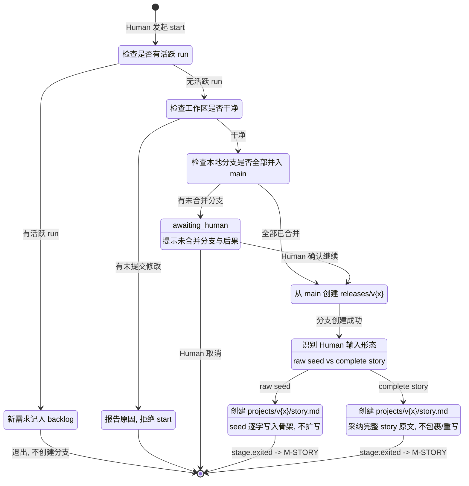

> 可休眠点：AWAIT_CONFIRM。
> 退出条件：release 分支存在 + story.md 就位（raw seed 骨架或被采纳的完整 story）+ stage.entered(M-START) 已落盘。

## 4. M-STORY

**目的**：将 release 启动输入转化为人类已裁定、机器可校验的 story.md。本阶段唯一产物是文档，不产生代码。两条输入路径在 TRIAGE/DRAFT 行为上分流：raw seed 由 Scribe 在 GO 后按模板展开；complete story 原样作为基线，TRIAGE 仅评审、DRAFT 只落地已 resolved 讨论结论与显式 Human 编辑。

**进入条件**：M-START 通过（release 分支已创建，`projects/v{x}/story.md` 就位--raw seed 骨架或被采纳的完整 story）。

### 4.1. 子状态机

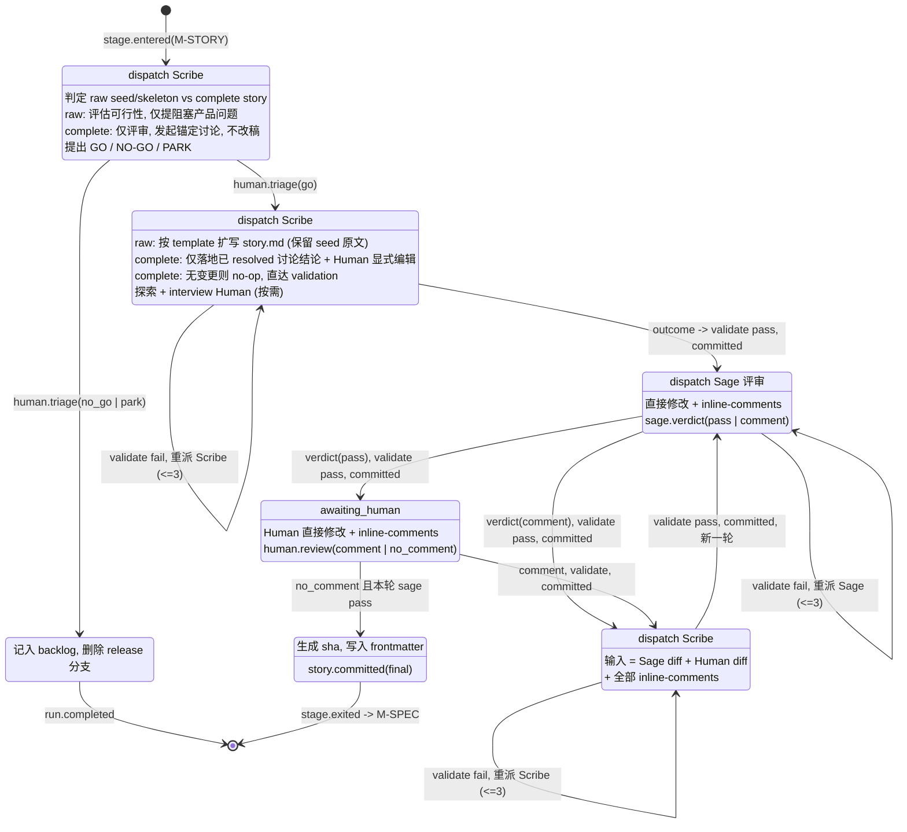

> validate = schema 校验 + scope 检查（只动 story.md）。失败带工具原始输出重派同一作者，上限 3 次，超限升级 Human。
> 可休眠点：TRIAGE 等人类裁决、HUMAN_REVIEW 等人类评审。decide() 返回空 command，run 挂起，事件回放恢复。
> 退出硬条件：同一轮收齐 human.review(no_comment) + sage.verdict(pass)。


### 4.2. 两条输入路径（M-START 分类，M-STORY 继承）

M-START 据 Human 输入形态分流，M-STORY 的 TRIAGE/DRAFT 按同一形态行为分支；两种路径共用同一 go/no-go/park Human gate 与后续 Sage/Human review。

- **Raw seed 路径**：Human 提供一行/简短设想。M-START 将 seed 逐字记入 story 骨架（不扩写、不转述）。TRIAGE 评估可行性、就阻塞性产品问题发起锚定讨论，提出 go/no-go/park；**不在 TRIAGE 展开 story**。Human 选 GO 后，DRAFT 按 story 模板把骨架展开为完整 story.md，原始 seed 原文必须保留在 §1。
- **Complete story 路径**：Human 提供或采纳已写就的完整 story。M-START 原样采纳为初始 story 文档，**绝不把整篇 story 引用/包裹进 §1 原始输入**。TRIAGE 仅评审既有 story 并发起锚定讨论；**绝不改写、重排章节、模板迁移、表格/散文互转、以「spec 泄漏」删除内容或重建文档**。GO 后 DRAFT 以既有 story 为基线，仅落地已 resolved 的讨论结论与 Human 显式编辑；两者皆无则为 no-op，直接进入 validation/review，不因 latest-template 差异而回溯迁移。


### 4.3. story.md 结构契约（机器可校验）

- frontmatter：`story_id` / `title` / `created` / `status` / `sha`（`title`：人类引用 story 的有意义名字，非编号；start 时留空，Scribe 起草时写入非空）
- 固定章节(见 templates/story.md)
- 本阶段不设规模限制。release 规模由需求阶段控制：一次 release 最多 30 条功能需求，超出则从 story 重新拆起
- 行为种子须预答"将来用什么断言验证我"。断言是产品级可观察事实（"用户结账后总额减少 20%"），不是技术命令（"curl | jq"）——技术验证路径由 Sage 在 M-ACC 选择。写不出断言的种子说明需求太模糊，须在 interview 中追问到可断言为止

### 4.4. 事件清单

```
story.requested / stage.entered / command.issued /
interview.started / interview.ended / outcome.received /
verdict.passed | verdict.failed / story.committed /
writelock.granted | writelock.released /
review.round_started / human.triage(go|no_go|park) /
human.review(comment|no_comment) / sage.verdict(pass|comment) /
stage.exited
```


### 4.5. 硬规则

1. 人类裁定与评审结论都是一等事件：没有 `human.triage(go)`，且未收齐 `human.review(no_comment)` + `sage.verdict(pass)`，decide() 不会产出进入 M-SPEC 的 command。story.md 里的分流表格只是事件的投影展示。
2. 单写者纪律：任一时刻只有一个 actor 持有编辑权（顺序评审天然保证）；Scribe/Sage/Human 的所有落盘变更均由 Runtime 提交为独立 commit。
3. **可休眠**：等待人类时 run 停在 awaiting_human，decide() 返回空 command 但 run 未终结，进程可退出；人类回来时从事件回放恢复继续。不得在内存里悬挂等待状态（Agent 会话状态的保留需单独设计，见 Aaron 注记）。

## 5. M-SPEC

**目的**：将已裁定的 story 转化为可断言的功能/非功能需求（spec.md）。Sage 创建 spec 文档，人类和 Lex 共同评审。

**进入条件**：M-STORY 通过（`human.triage(go)` + `human.review(no_comment)` + `sage.verdict(pass)` 收齐）。

### 5.1. 子状态机

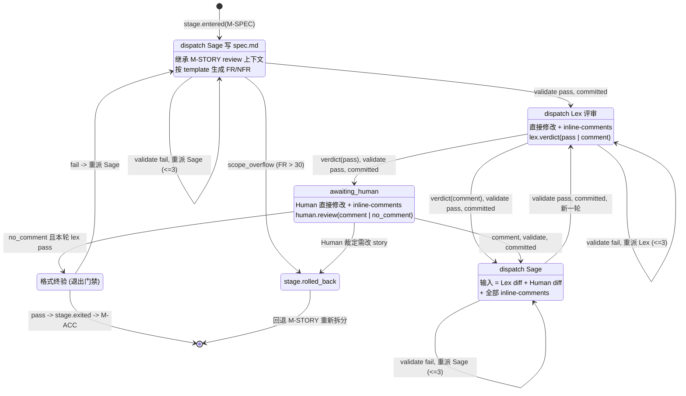

> validate = schema（FR/NFR 编号、章节结构）+ scope + story->spec 覆盖 trace。失败带工具原始输出重派同一作者，上限 3 次，超限升级 Human。
> scope_overflow（FR > 30）不重派压缩，直接 rolled_back 回 M-STORY 重新拆分。回退落点为 **DRAFT**（不重复 TRIAGE——triage 裁决已存在，重问违反"人类不做技术决策"）。
> 可休眠点：HUMAN_REVIEW。
> 退出硬条件：同一轮收齐 human.review(no_comment) + lex.verdict(pass) + 格式终验通过。
> Lex 评审协议与 M-STORY 的 Sage 评审同构；M-ACC 复用本节状态机（文档对象换为 acceptance.md，validate 规则见 M-ACC 节）。

### 5.2. 事件清单

```
stage.entered / command.issued / outcome.received /
verdict.passed | verdict.failed(scope_overflow|schema|trace) /
spec.committed / review.round_started /
human.review(comment|no_comment) / lex.verdict(pass|comment) /
stage.rolled_back / stage.exited
```

### 5.3. 硬规则

1. 退出 M-SPEC 需同一轮收齐 `human.review(no_comment)` + `lex.verdict(pass)` + 格式终验 `verdict.passed`。
2. 单写者纪律同 M-STORY：任一时刻只有一个 actor 持有编辑权，所有落盘变更由 Runtime 提交为独立 commit。
3. 作者响应评论的角色固定为文档作者本人（story->Scribe，spec->Sage），reviewer 不直接改稿。

## 6. M-ACC

**目的**：为 spec 中每条需求生成外部可观察、可判定 PASS/FAIL 的验收标准（acceptance.md）。

**进入条件**：M-SPEC 通过（语义评审结束 + 格式终验通过）。

### 6.1. 子状态机

状态机同 M-SPEC（§5.1），差异点：

- 文档对象：`acceptance.md`（替代 `spec.md`）
- 作者：Sage（继承 M-SPEC 上下文）
- reviewer：Lex + Human
- validate 规则：schema + scope + **AC↔FR 双向覆盖 trace**（每条 FR 至少一条 AC，每条 AC 回指存在的 FR，孤立项 = `verdict.failed(trace)`）
- 每条 AC 必须是产品级可观察断言，承接 story 行为种子，不得引入新产品行为
- 退出门禁：格式终验（同 M-SPEC）
- ROLLBACK 目标：M-SPEC 或 M-STORY（`stage.rolled_back`）

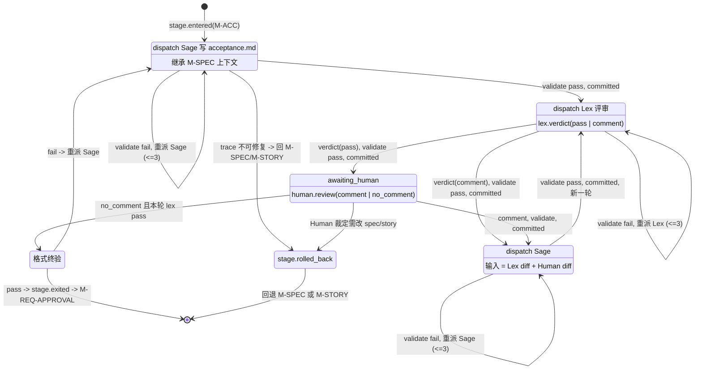

### 6.2. 事件清单

同 M-SPEC 同构，文档事件为 `acceptance.committed`；回退事件 `stage.rolled_back` 目标可为 M-SPEC 或 M-STORY。

## 7. M-REQ-APPROVAL

**目的**：Human 将 story/spec/acceptance 三件套批准为本轮需求 baseline，之后才允许进入设计/实现。

**进入条件**：story、spec、acceptance 均通过 review。

### 7.1. 子状态机

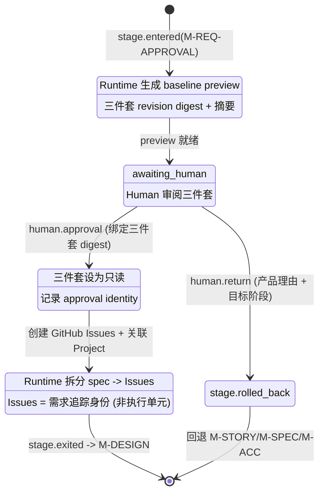

> 可休眠点：AWAIT_HUMAN。
> Freshness：三件套任一文档变化立即使 approval stale（digest 不匹配），下游被阻断，必须重新走 M-REQ-APPROVAL。

### 7.2. 硬规则

1. **Agent 不能批准、拒绝或代替 Human 回答**；没有 `human.approval` 事件，decide() 不产出任何进入设计/实现阶段的 command。
2. **Freshness**：三件套任一文档内容变化立即使 approval stale，下游工作被阻断。
3. Issues 是需求追踪身份，不是执行单元；实施切片（task graph）在 M-IMPL Planning 才产生，二者映射但不互相冒充。

## 8. M-DESIGN

**目的**：Archer 产出 Test Plan、Architecture、Interfaces 三文档、接口桩（interfaces.md 的可执行形态：与真实模块同路径、完整签名、行为体仅 raise + 合同 token）及宿主项目 machine contracts（至少覆盖 integration/e2e、GitHub CI、pre-commit、release version、build/artifact、发布恢复）；Prism 独立评审。这是纯技术阶段：Human 是可选 reviewer，允许缺席，意见不是批准门禁。接口桩是 ATDD 次序的基础设施：M-TEST 的 Shield 对着它们写 integration/e2e，保证实现之前即可 collect/import。

**进入条件**：`human.approval` 对当前三件套 digest 有效（M-REQ-APPROVAL 通过且未 stale）。

### 8.1. 子状态机

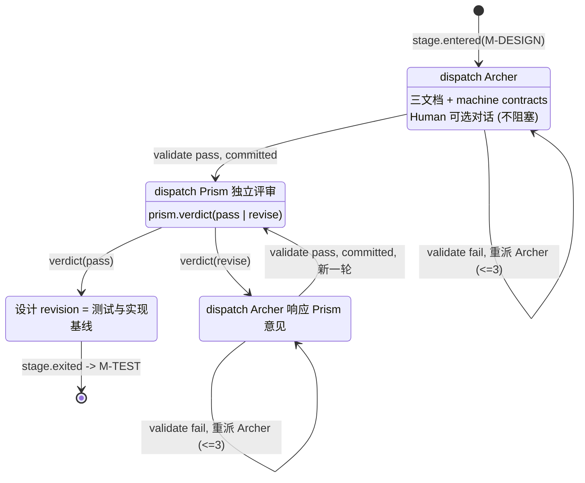

> validate = 文档结构 + AC→Test Plan 分层覆盖（每条 AC 有 test layer 归属）+ 每条 integration/e2e 声明变绿条件（所依赖接口的 IF- 标识，供 M-IMPL task 变绿子集划分）+ contracts 清单完整性。
> **不等待 Human 批准**：退出只要求 validate pass + prism.verdict(pass)。Human 缺席不阻塞，建议由 Archer 技术裁量。
> **NO_DIFF peer review**（v0.5+）：当 `requires_diff` 校验对 Archer 结果触发（Archer 产出无文件 diff），不直接判 failure，而是进入 NO_DIFF_EXPLAIN->NO_DIFF_REVIEW 子状态机：Archer 解释无 diff 原因->Prism 评审解释->pass 恢复 pipeline / revise 判 `verdict.failed(no_diff_justified)`。讨论 blockquote 是物理文件变更但不是语义修改，不触发 no_diff。
> 可休眠点：无（Human 不参与门禁）。

### 8.2. 事件清单

`stage.entered` / `command.issued` / `outcome.received` / `verdict.passed|failed(schema|trace|no_diff)` / `design.committed` / `prism.verdict(pass|revise)` / `review.round_started` / `no_diff.detected` / `no_diff.explained` / `no_diff.reviewed` / `stage.exited` / `stage.rolled_back`

### 8.3. 硬规则

1. Human 无技术否决权也无到场义务；退出只要求 `verdict.passed`（程序）+ `prism.verdict(pass)`。
2. contracts 由 Archer 设计，**安装/更新/回读副作用只归 Runtime**；Devon 不得安装或修改 hook 绕过门禁。
3. 设计文档与 contracts 均有 revision/digest，修订使依赖旧 revision 的下游证据 stale。

## 9. M-TEST

**目的**：Shield 按 Test Plan 对着接口桩编写 integration/e2e 测试；Prism 独立评审测试合约；Runtime 独立验证"可 collect 且合法地失败（合法 Red）"。本阶段交付的是测试资产（Red 状态），不是绿色结果——变绿是 M-IMPL 的职责。

**定位（外圈合同循环）**：本阶段写下"大小两个测试循环"的**外圈**——integration/e2e 测试是实现存在之前写好的合同：先行变红、冻结为基线，M-IMPL 阶段的目标就是把这一圈全部变绿。内圈 RGR 循环见 §10（D-32）。

**进入条件**：M-DESIGN 通过（`prism.verdict(pass)` + 程序校验通过）。

### 9.1. 子状态机

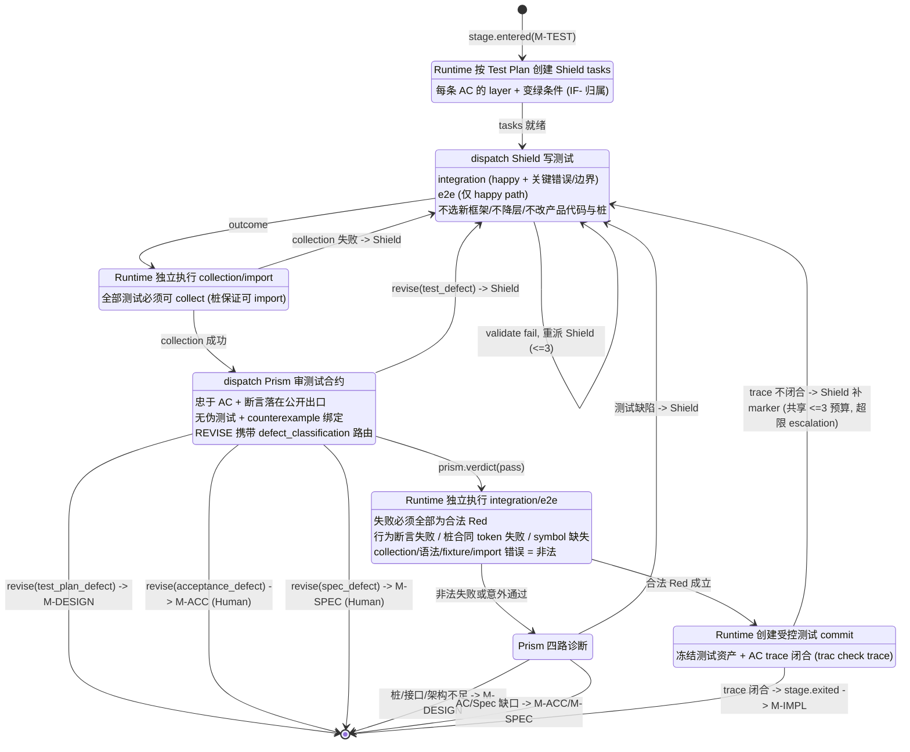

> 退出是"测试资产齐备且 Red 合法"，不是"执行全部通过"；通过的要求推迟到 M-IMPL 出口门禁。
> AC trace 闭合的依据是 `trac check trace` 程序证据：每条 required AC 至少一条测试绑定（R-1 长格式 marker `#|// AC-FRXXXX-YY@<version> TRACKS-TRACE ...`，特征词强制），无测试的 AC 与无主 marker 均为硬错误；trace 不闭合不得退出--需求追踪（trace/reach）因此必须与 M-TEST 同一 release 交付。
> 本阶段测试意外通过是异常（桩只 raise，通过通常说明测试没有真正命中桩）-> DIAGNOSE。
> "测试错还是接口错"的分流永不交给 Human；需语义判断时分派 Prism diagnostic review。
> 修复后重跑受影响测试并要求 Prism 对新 revision 重新 review。
> **defect_classification 路由**（v0.5+）：PRISM_REVIEW 的 `revise` 判定携带 `defect_classification` 字段，Runtime 据此路由回退目标：`test_defect`（默认）回 Shield WRITE 重派；`test_plan_defect` 回 M-DESIGN 让 Archer 修测试计划；`acceptance_defect` 回 M-ACC（需 Human）；`spec_defect` 回 M-SPEC（需 Human）。原则：什么产物出问题，就回退到该产物诞生的阶段。
> **NO_DIFF peer review**（v0.5+）：当 `requires_diff` 校验对 Shield 结果触发（Shield 产出无文件 diff），进入 NO_DIFF_EXPLAIN->NO_DIFF_REVIEW 子状态机（同 M-DESIGN）。讨论 blockquote 是物理文件变更但不是语义修改，不触发 no_diff；纯 self_report（无任何文件变更）才触发。
> M-TEST 共享 <=3 重派预算：WRITE 校验失败、PRISM revise(test_defect)、trace 不闭合、criteria_pack_mismatch、commit 被拒、test_defect 均消费同一计数器；第 3 次仍未通过 -> escalation (awaiting_human)。`test_plan_defect`/`acceptance_defect`/`spec_defect` 的回退不消费重派计数器（它们是上游产物缺陷，不是本阶段执行失败）。

### 9.2. 事件清单

`stage.entered` / `command.issued` / `outcome.received` / `test.collected(passed|failed)` / `prism.verdict(pass|revise)` / `red.validated(valid|invalid)` / `verdict.failed(trace|criteria_pack_mismatch|test_defect|test_plan_defect|stub_gap|ac_gap|spec_gap|commit|no_diff_justified)` / `no_diff.detected` / `no_diff.explained` / `no_diff.reviewed` / `test.committed` / `stage.exited` / `stage.rolled_back`

### 9.3. 硬规则

1. Shield 不 git add/commit/push、不判定 PASS；collection 与执行结果以 Runtime 复跑为准。
2. Shield 不修改产品代码与接口桩；桩或接口缺口走 gap advisory 回 M-DESIGN，不得在测试侧绕过。
3. 本阶段接受并要求 Red：每条测试的失败原因必须可分类为合法 Red，且 AC 层归属与 Test Plan 一致；Runtime 复跑是唯一证据来源。
4. 退出依据全部是程序证据：collection、合法 Red 分类与 `trac check trace` 闭合均由 Runtime 复跑取得；Shield 的覆盖自述（"每条 AC 都有测试"）不构成退出依据。

## 10. M-IMPL

**目的**：Archer 把需求/设计基线拆成可独立验证的 implementation task graph；Devon 逐 task 以 Red→Green→Refactor 完成实现，把 Shield 的 integration/e2e 测试变绿并补齐单元测试；Prism 在 Red checkpoint 与最终 task range 两处独立评审。

**定位（内圈 RGR 循环）**：本阶段是"大小两个测试循环"的**内圈**——Devon 逐 task 走 Red→Green→Refactor，用这一圈圈的小循环去驱动外圈合同循环（Shield 的 integration/e2e 测试，见 §9）变绿。内圈保证每一步的质量，外圈负责最终验收（D-32）。

**进入条件**：M-TEST 退出条件成立（事件：`stage.exited(M-TEST)`，测试资产已冻结并进入 baseline）。

### 10.1. 子状态机

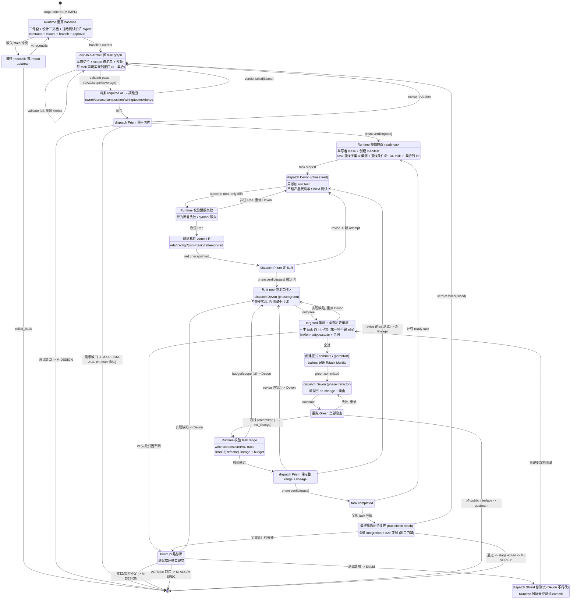

> 绿的粒度：task 级 GREEN_GATE 只跑该 task 单测与 test-plan 变绿条件归属的 int 子集，第一轮实现不跑 e2e；全量 integration+e2e 变绿是 M-IMPL 出口门禁（ISLAND_GATE_2）。
> 孤岛闭合以 `trac check reach` 为依据：从声明入口点做模块级 import 可达分析，报告不可达的生产模块；与 trace 同属需求追踪工具，消费点还有 M-VERIFY 的反 slop 门禁。
> Red 测试先于实现是程序可验证的 lineage 事实（B/R/G commit 拓扑），不是 Agent 自报。
> 单写者纪律：Devon 不得修改 Shield 的测试；测试缺陷经 DIAGNOSE→SHIELD_FIX 由 Shield 修复并产生受控测试 commit。
> 可休眠：每个 phase 边界都是事件，重启从 lineage + 事件回放恢复到精确 phase。
> 同一 attempt 重试只能得到同一 R（compare-and-set），否则产生新 attempt；旧 attempt 不被改写。

### 10.2. 事件清单

`stage.entered` / `baseline.frozen` / `taskgraph.committed` / `task.started` / `writelock.granted|released` / `red.checkpointed` / `prism.verdict(pass|revise)` / `green.committed` / `refactor.committed|no_change` / `verdict.failed(red_invalid|regression|budget|island|scope|test_defect|impl_defect)` / `test.committed` / `task.completed` / `stage.exited` / `stage.rolled_back`

### 10.3. 硬规则

1. Devon 只能编辑 manifest 授权文件；不碰需求/设计 artifact、Shield 测试、task 状态、Git history、Issue；不 commit/push（正式 commit 均由 Runtime 创建）。
2. Red 测试先于实现是程序可验证的 lineage 事实（B/R/G commit 拓扑），不是 Agent 自报。
3. 同一 attempt 重试只能得到同一 R（compare-and-set），否则产生新 attempt；旧 attempt 不被改写。
4. 可休眠：每个 phase 边界都是事件，重启从 lineage + 事件回放恢复到精确 phase。
5. "测试错还是实现错"的分流永不交给 Human：测试缺陷由 Shield 修，实现缺陷由 Devon 修，各自产生独立的受控 commit 与证据。

## 11. M-VERIFY

**目的**：冻结 release candidate，跑完整本地权威质量链 + GitHub CI + 版本/构建物验证，Prism 做整体一致性复审。

**进入条件**：M-IMPL 通过（事件：`stage.exited(M-IMPL)`）。

### 11.1. 子状态机

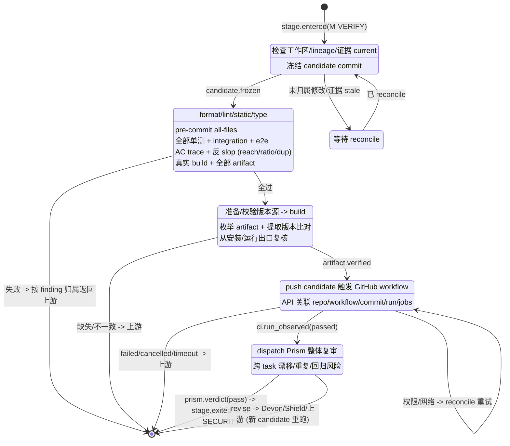

> 所有 gate 必须对**同一** candidate PASS；不存在"部分基于旧 commit 的绿色"。
> CI 结果以 API 回读为准，永不采信 Agent 转述。
> 局部 test selector 只供开发反馈，不替代全量 gate；"与本次需求无关"不是排除历史测试的理由。

### 11.2. 事件清单

`stage.entered` / `candidate.frozen` / `check.executed(各 gate)` / `ci.run_observed(passed|failed)` / `artifact.verified` / `prism.verdict(pass|revise)` / `verdict.failed(...)` / `stage.exited` / `stage.rolled_back`

### 11.3. 硬规则

1. 所有 gate 必须对**同一** candidate PASS；不存在"部分基于旧 commit 的绿色"。
2. CI 结果以 API 回读为准，永不采信 Agent 转述。

## 12. M-SECURITY

**目的**：程序安全扫描 + Judge 语义安全审计；findings 四路归因。

**进入条件**：M-VERIFY 通过（事件：`stage.exited(M-VERIFY)`）。

### 12.1. 子状态机

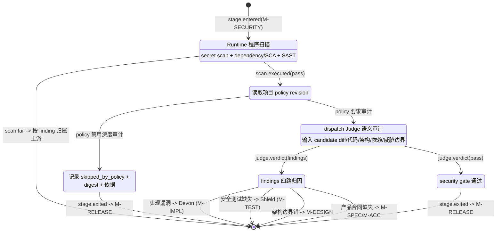

> 修复后必须重过受影响的 M-IMPL/M-TEST、**完整 M-VERIFY** 与 Judge 复审。
> critical/high finding 不可 waiver；涉及认证/权限/secret/支付/敏感数据的变更不得静默跳过。

### 12.2. 事件清单

`stage.entered` / `scan.executed` / `judge.verdict(pass|findings)` / `security.skipped_by_policy` / `verdict.failed(security)` / `stage.exited` / `stage.rolled_back`

## 13. M-RELEASE（Human 发布门禁）

**目的**：Human 授权不可逆发布副作用。

**进入条件**：M-SECURITY 通过（或合法 policy skip）。

### 13.1. 子状态机

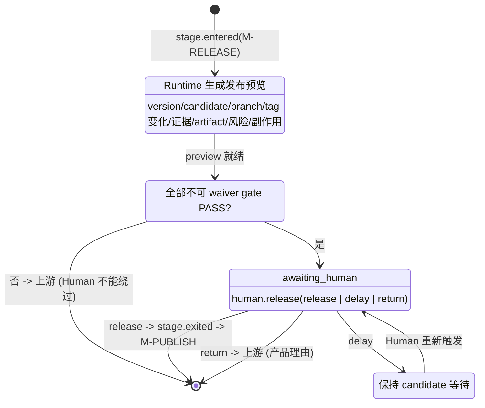

> candidate/artifact/证据/发布计划任一变化 → 旧 approval stale，必须新 preview。
> 可休眠点：AWAIT_HUMAN、DELAYED。

### 13.2. 硬规则

1. Agent 可总结证据，不能代替 Human 作发布决定，也不得把技术风险选择推给 Human。
2. Human 不能用发布确认绕过失败的门禁。

## 14. M-PUBLISH

**目的**：Runtime 执行不可逆外部副作用（merge、tag、artifact 发布、GitHub Release、部署）；幂等 + write-ahead + reconcile。

**进入条件**：M-RELEASE 通过（`human.release(release)` 绑定 preview digest）。

### 14.1. 子状态机

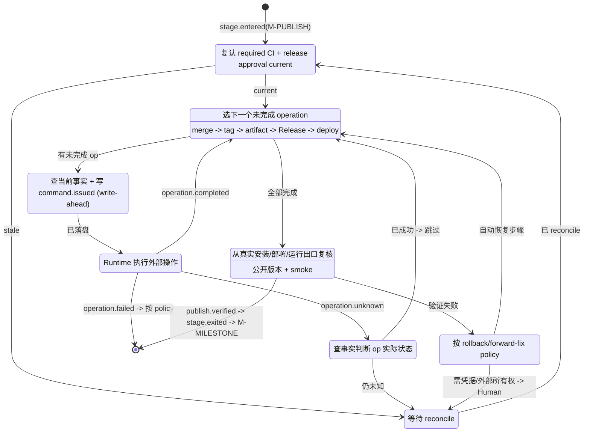

> tag、Release、registry publish、merge、部署不得由 Agent 执行或用聊天文本模拟。
> 中断后逐项 reconcile：已成功 operation 不重复执行；不重打不同 tag、不覆盖不可变 artifact。
> 全部必需操作 + 公开版本验证成功前，状态保持 `publishing`/`needs_attention`，不得标记完成。

### 14.2. 事件清单

`stage.entered` / `command.issued` / `operation.completed|failed|unknown` / `publish.verified` / `stage.exited`

## 15. M-MILESTONE

**目的**：trace 最终闭包 + 幂等收尾归档；可选 Librarian 知识提炼。

**进入条件**：M-PUBLISH 通过（`publish.verified`）。

### 15.1. 子状态机

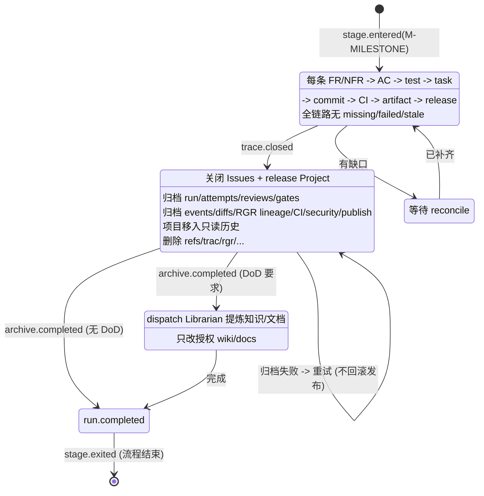

> 发布成功但归档/清理失败 → 保持 `closing` 重试；不得回滚真实发布事实或创建第二次发布。

### 15.2. 事件清单

`stage.entered` / `trace.closed` / `archive.completed` / `run.completed` / `stage.exited`

## 16. Bug Fix / Hotfix 变体

1. `bug_fix` 只适用于已发布产品相对既有 approved Spec/AC 的**实现偏差**；Runtime 先验证 Issue、source contract、目标版本、可复现失败；实际是新行为 → 退出 hotfix，进 backlog/new feature。
2. `quick_rgr` 继承 source requirement approval；`design_required` 还需形成当前 M-DESIGN revision。涉及 public interface/数据迁移/安全边界/跨模块设计 → 先走 M-DESIGN；拿不准时由 Archer/Prism 技术判断，不让 Human 选架构路径。
3. 两条路径都复用 `M-TEST → M-IMPL → M-VERIFY → M-SECURITY/policy → M-RELEASE → M-PUBLISH → M-MILESTONE`；开发反馈可按影响收窄，但 M-VERIFY 的历史回归与 required CI 不能省。
4. Hotfix 不因“改动小”自动跳过 Prism；review 深度可按风险调整，但必须有独立语义 review 和权威回归证据。
5. Runtime 是唯一 branch/worktree authority：创建隔离 `fix/{issue}`，防止与 active release 串写；发布后同步修复到 main 与受影响的 active release，冲突 → `needs_attention`。

## 17. 通用返回、修改与恢复规则

### 17.1. Return Upstream

- Agent 只能返回有证据和锚点的 gap advisory；Runtime 根据 workflow 定义校验合法目标并移动流程。路由决定的机器可读形式是 FailureDecision（classification、target stage/owner、artifact disposition、new attempt kind、human_required），与 transition 一起 append-only 写入事件日志。
- 回 M-DESIGN：task graph/架构/接口/Test Plan/技术合同需要改变 → Archer+Prism 裁定，不需 Human。
- 回 M-SPEC/M-ACC：用户结果、权限、范围、数据后果、不可逆语义需要改变 → Runtime 先展示影响，Human 批准；修订后重新完成 review 与 M-REQ-APPROVAL。
- 返回后 Runtime 保留历史，但将目标之后的 task graph、baselines、lineage、commits/reviews、candidate、CI/artifact/security/release approval 标记 stale/superseded；不得继续复用旧绿色证据。

### 17.2. Human 或外部工具直接修改

- Runtime 在每个写 lease 和 program gate 前比较 workspace 与 baseline，识别 Human/外部直接修改的 diff，不静默覆盖。
- 符合 baseline 且过当前 review/gates → 可纳入受控 commit；有问题 → 相应 Agent 通过 discussion 提出，不把“Human 写的”当自动批准；改变 baseline 或来源不明 → 停止当前 task，要求合法 return-upstream 或 reconcile。

### 17.3. Retry、Waiver 与取消

- retry 只重试幂等/reconcile-safe 的 operation；每次 attempt 独立 identity，旧 attempt 不改写。
- waiver 只适用于 policy 明确列出的非关键检查，绑定 actor/理由/范围/candidate/到期条件。**不可 waiver**：M-REQ-APPROVAL、release approval、trace/freshness、required CI、artifact version、critical security、发布身份。
- Human 可取消未发布的 run：Runtime 停止新分派、处理当前 lease、保留审计、清理资源；已产生外部发布事实后只能进发布恢复/关闭，不得用取消抹除历史。
- 生产 Runtime Agent 派发不设 elapsed-time 超时：工作中的 Agent 不会仅因 N 秒过去而被杀死；活动性由 Runtime/operator 观测，显式 Human Ctrl-C 取消并清理进程组（D-11 取消协议）。测试 harness/网络/CI 总看门狗属独立测试/IO 关注点，可保留有界超时。
- 模型选择归 opencode agent/project 配置；tracks 不得在应用代码中把 IQ 档位映射到 provider/model。显式 `TRAC_AGENT_MODEL` 仅作 operator override。
- 升级可观测：<=3 次失败后，`trac run` 与 `trac status` 必须暴露 attempt 计数 + 失败类 + 原因。Human 可运行 `trac retry`--追加 `human.retry` 事件、清除升级 gate、重置一份新的 <=3 attempt 预算、保留失败证据，且不自动重新派发；后续由显式 `trac run` 恢复。
- `trac run` 必须为长时间 Agent 派发发出简洁、已 flush 的控制台活动：开始输出时间戳/Agent/stage(substate)/task(attempt)，完成输出状态/失败与耗时；不得流式输出海量 Agent stdout。
