## 1. The Diagram

全流程 canonical stage 序列（也是 workflow.py 状态机的顶层状态集，不得增设同级阶段）：

```
M-START → M-STORY → M-SPEC → M-ACC → M-REQ-APPROVAL → M-DESIGN
→ M-TEST → M-IMPL → M-VERIFY → M-SECURITY → M-RELEASE → M-PUBLISH → M-MILESTONE
```

| 阶段           | 主要作者/执行者                               | 评审 / Human 参与                    | 权威退出条件                              |
| -------------- | --------------------------------------------- | ------------------------------------ | ----------------------------------------- |
| M-START        | Runtime 建 release foundation                 | Human 发起                           | 资源身份一致且可恢复                      |
| M-STORY        | Scribe                                        | Sage 独立评审；Human 裁决+评审       | review 闭合，Human Go                     |
| M-SPEC         | Sage                                          | Lex 独立评审；Human 评审             | 语义+程序校验通过（含 FR≤30）             |
| M-ACC          | Sage                                          | Lex 独立评审；Human 评审             | 覆盖+程序校验通过                         |
| M-REQ-APPROVAL | Runtime 生成 baseline preview                 | **Human Approve/Return**             | approval 绑定三件套 digest                |
| M-DESIGN       | Archer（三文档 + 接口桩 + machine contracts） | Prism 独立评审；Human 可选、允许缺席 | Prism + 程序校验通过，不等 Human          |
| M-TEST         | Shield（integration/e2e，对着接口桩写）       | Prism 审测试合约                     | 全量 collect + R2 合法 Red + trace 闭合   |
| M-IMPL         | Archer 拆 task graph；Devon 逐 task RGR       | Prism 评 Red checkpoint 与最终 range | 全部 task 完成且 FULL_F 绿，孤岛闭合      |
| M-VERIFY       | Runtime 冻结 candidate                        | Prism 整体一致性复审                 | FULL_F 复用/重跑 + CI + build/artifact 通过 |
| M-SECURITY     | Runtime 程序扫描；Judge 语义审计              | Judge                                | security gate 通过或合法 policy skip      |
| M-RELEASE      | Runtime 生成发布预览                          | **Human Release/Delay/Return**       | release approval 绑定 candidate           |
| M-PUBLISH      | Runtime 执行发布副作用                        | —                                    | 幂等外部操作+发布后验证完成               |
| M-MILESTONE    | Runtime 收尾；Librarian 可选提炼              | —                                    | trace 闭包、归档、清理完成                |

**仅有的两个 Human gate stage**：M-REQ-APPROVAL（批准需求 baseline）与 M-RELEASE（授权发布副作用）。Human 在其它阶段仍可做产品决定，但不增设新 gate stage。Planning/Red/Green/Refactor 是 M-IMPL 内部 checkpoint，不升级为 stage。

## 2. 全流程不变量

1. **Runtime 是唯一流程 authority**：只有 Runtime 可创建/推进/回拨阶段、授予写权限、执行 commit/push、外部 API、CI、发布和归档副作用。
2. **Agent 只产出专业语义或代码**：不 commit/push、不写 PASS artifact、不改变 Issue/run 状态。
3. **Human 不承担技术决策**：Agent 不把架构/测试/实现/CI/修复方案当选择题推给 Human；只有产品意图、需求范围、发布时机、授权与不可逆外部冲突需要 Human。
4. **技术设计可按流程修订**：M-TEST→M-SECURITY 期间任何 Agent 可提有锚点的 design-gap advisory；Archer+Prism 双确认即回 M-DESIGN，不需 Human；涉及产品意图/需求范围才回 M-SPEC/M-ACC 并经 Human 批准。
5. **回退原则--什么产物出问题，就回退到该产物诞生的阶段**：test-plan 缺陷回 M-DESIGN（Archer 修）；AC 缺口回 M-ACC（需 Human）；Spec 缺口回 M-SPEC（需 Human）。Prism 的 REVISE 判定携带 `defect_classification` 字段指定路由目标，Runtime 执行回退。本阶段执行失败（test_defect 等）消费重派预算；上游产物缺陷（test_plan_defect/acceptance_defect/spec_defect）的回退不消费重派预算。
6. **所有结果绑定身份**：task/diff/review/test/CI/artifact/finding/gate 均绑定 baseline digest + commit + attempt + actor；上游变化使受影响结果 stale。
7. **Agent 自报不是证据**：“tests passed”、命令输出摘要或聊天文本不能推进阶段；Runtime 必须从权威程序出口重新执行或读取证据（即 arch.md 的“永不信自述”）。
8. **实现发生在当前 release branch**：普通 feature 不建 per-task branch/worktree，Runtime 串行授予单写者 lease；仅 hotfix 建隔离 `fix/{issue}` 分支。
9. **失败不伪报成功**：失败/取消/超时/缺失/skip/不确定均不得标记 PASS（fail closed）。
10. **下一步只由纯函数决定**：`decide(current_state, validated_result, program_evidence, workflow)` 选择 success edge 或合法返回；Agent/reviewer 的 recommendation 仅作诊断，永不构成跳转命令，任何一方不能直接命名目标 stage。

> **界面通道说明**：流程中所有 Human 动作（裁决、评审、批准、重试）都建模为事件；网页/CLI 只是事件的输入通道适配器。下文按网页交互描述，但 v1 可用 CLI + 本地编辑器跑通全流程（按钮→trac 命令，网页编辑→直接改文件，编辑权/写锁→Runtime 基于 git 工作区状态裁定）。

## 3. M-START (创建新的 release)

**目的**：建立 release 工作基础——release 分支、projects/v{x}/ 目录、初始 story.md。支持两种 Human 启动输入：(1) 原始 seed（一行/简短设想），逐字记入 story 骨架；(2) 已写就的完整 story，原样采纳为初始 story 文档（绝不将其整体引用/包裹进 §1 原始输入）。

**进入条件**：Human 发起新 release 请求，并提供原始 seed 或已写就的完整 story。

### 3.1. 子状态机

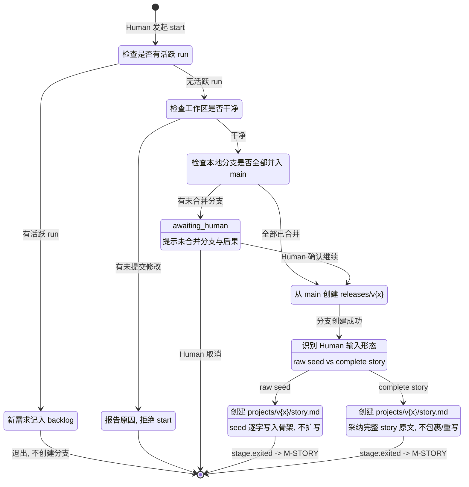
```mermaid
stateDiagram-v2
    direction TB

    [*] --> CHECK_ACTIVE : Human 发起 start

    CHECK_ACTIVE : 检查是否有活跃 run
    CHECK_ACTIVE --> BACKLOG : 有活跃 run
    CHECK_ACTIVE --> CHECK_WORKSPACE : 无活跃 run

    BACKLOG : 新需求记入 backlog
    BACKLOG --> [*] : 退出, 不创建分支

    CHECK_WORKSPACE : 检查工作区是否干净
    CHECK_WORKSPACE --> FAILED : 有未提交修改
    CHECK_WORKSPACE --> CHECK_BRANCHES : 干净

    FAILED : 报告原因, 拒绝 start
    FAILED --> [*]

    CHECK_BRANCHES : 检查本地分支是否全部并入 main
    CHECK_BRANCHES --> AWAIT_CONFIRM : 有未合并分支
    CHECK_BRANCHES --> CREATE_BRANCH : 全部已合并

    AWAIT_CONFIRM : awaiting_human
    AWAIT_CONFIRM : 提示未合并分支与后果
    AWAIT_CONFIRM --> CREATE_BRANCH : Human 确认继续
    AWAIT_CONFIRM --> [*] : Human 取消

    CREATE_BRANCH : 从 main 创建 releases/v{x}
    CREATE_BRANCH --> CLASSIFY_INPUT : 分支创建成功

    CLASSIFY_INPUT : 识别 Human 输入形态
    CLASSIFY_INPUT : raw seed vs complete story
    CLASSIFY_INPUT --> WRITE_SEED : raw seed
    CLASSIFY_INPUT --> ADOPT_STORY : complete story

    WRITE_SEED : 创建 projects/v{x}/story.md
    WRITE_SEED : seed 逐字写入骨架, 不扩写
    WRITE_SEED --> [*] : stage.exited -> M-STORY

    ADOPT_STORY : 创建 projects/v{x}/story.md
    ADOPT_STORY : 采纳完整 story 原文, 不包裹/重写
    ADOPT_STORY --> [*] : stage.exited -> M-STORY
```

> 可休眠点：AWAIT_CONFIRM。
> 退出条件：release 分支存在 + story.md 就位（raw seed 骨架或被采纳的完整 story）+ stage.entered(M-START) 已落盘。

## 4. M-STORY

**目的**：将 release 启动输入转化为人类已裁定、机器可校验的 story.md。本阶段唯一产物是文档，不产生代码。两条输入路径在 TRIAGE/DRAFT 行为上分流：raw seed 由 Scribe 在 GO 后按模板展开；complete story 原样作为基线，TRIAGE 仅评审、DRAFT 只落地已 resolved 讨论结论与显式 Human 编辑。

**进入条件**：M-START 通过（release 分支已创建，`projects/v{x}/story.md` 就位--raw seed 骨架或被采纳的完整 story）。

### 4.1. 子状态机

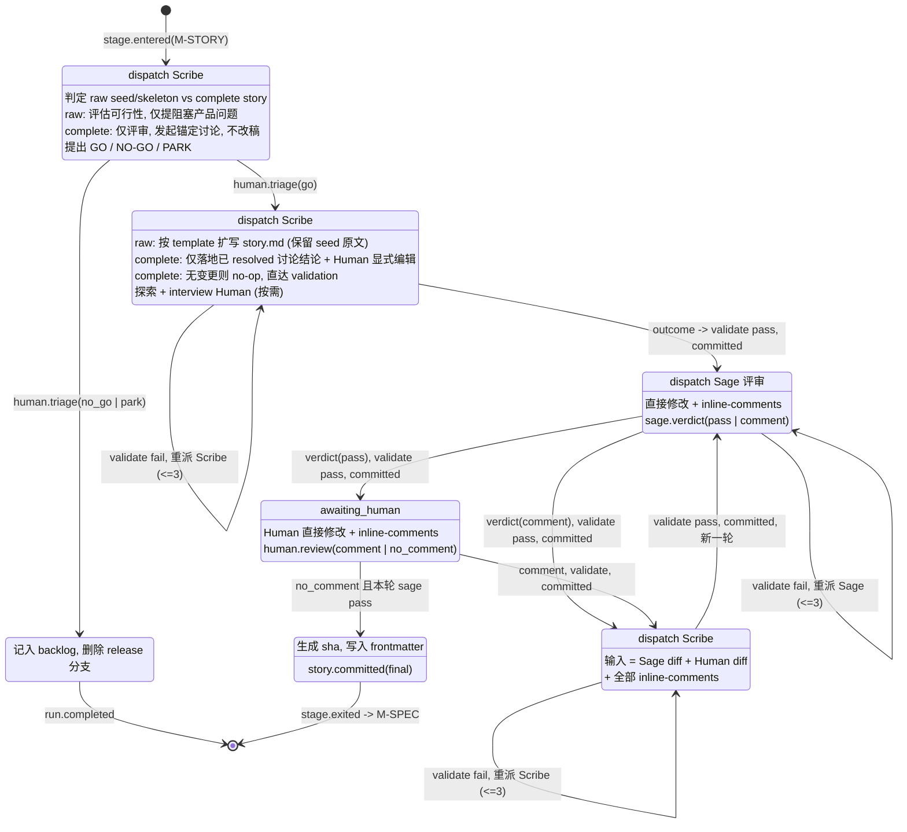
```mermaid
stateDiagram-v2
    direction TB

    [*] --> TRIAGE : stage.entered(M-STORY)

    TRIAGE : dispatch Scribe
    TRIAGE : 判定 raw seed/skeleton vs complete story
    TRIAGE : raw: 评估可行性, 仅提阻塞产品问题
    TRIAGE : complete: 仅评审, 发起锚定讨论, 不改稿
    TRIAGE : 提出 GO / NO-GO / PARK

    TRIAGE --> REJECTED : human.triage(no_go | park)
    REJECTED : 记入 backlog, 删除 release 分支
    REJECTED --> [*] : run.completed

    TRIAGE --> DRAFT : human.triage(go)

    DRAFT : dispatch Scribe
    DRAFT : raw: 按 template 扩写 story.md (保留 seed 原文)
    DRAFT : complete: 仅落地已 resolved 讨论结论 + Human 显式编辑
    DRAFT : complete: 无变更则 no-op, 直达 validation
    DRAFT : 探索 + interview Human (按需)

    DRAFT --> SAGE_REVIEW : outcome -> validate pass, committed
    DRAFT --> DRAFT : validate fail, 重派 Scribe (<=3)

    SAGE_REVIEW : dispatch Sage 评审
    SAGE_REVIEW : 直接修改 + inline-comments
    SAGE_REVIEW : sage.verdict(pass | comment)

    SAGE_REVIEW --> HUMAN_REVIEW : verdict(pass), validate pass, committed
    SAGE_REVIEW --> RESPOND : verdict(comment), validate pass, committed
    SAGE_REVIEW --> SAGE_REVIEW : validate fail, 重派 Sage (<=3)

    HUMAN_REVIEW : awaiting_human
    HUMAN_REVIEW : Human 直接修改 + inline-comments
    HUMAN_REVIEW : human.review(comment | no_comment)

    HUMAN_REVIEW --> EXIT : no_comment 且本轮 sage pass
    HUMAN_REVIEW --> RESPOND : comment, validate, committed

    RESPOND : dispatch Scribe
    RESPOND : 输入 = Sage diff + Human diff
    RESPOND : + 全部 inline-comments

    RESPOND --> SAGE_REVIEW : validate pass, committed, 新一轮
    RESPOND --> RESPOND : validate fail, 重派 Scribe (<=3)

    EXIT : 生成 sha, 写入 frontmatter
    EXIT : story.committed(final)
    EXIT --> [*] : stage.exited -> M-SPEC
```

> validate = schema 校验 + scope 检查（只动 story.md）。失败带工具原始输出重派同一作者，上限 3 次，超限升级 Human。
> 可休眠点：TRIAGE 等人类裁决、HUMAN_REVIEW 等人类评审。decide() 返回空 command，run 挂起，事件回放恢复。
> 退出硬条件：同一轮收齐 human.review(no_comment) + sage.verdict(pass)。


### 4.2. 两条输入路径（M-START 分类，M-STORY 继承）

M-START 据 Human 输入形态分流，M-STORY 的 TRIAGE/DRAFT 按同一形态行为分支；两种路径共用同一 go/no-go/park Human gate 与后续 Sage/Human review。

- **Raw seed 路径**：Human 提供一行/简短设想。M-START 将 seed 逐字记入 story 骨架（不扩写、不转述）。TRIAGE 评估可行性、就阻塞性产品问题发起锚定讨论，提出 go/no-go/park；**不在 TRIAGE 展开 story**。Human 选 GO 后，DRAFT 按 story 模板把骨架展开为完整 story.md，原始 seed 原文必须保留在 §1。
- **Complete story 路径**：Human 提供或采纳已写就的完整 story。M-START 原样采纳为初始 story 文档，**绝不把整篇 story 引用/包裹进 §1 原始输入**。TRIAGE 仅评审既有 story 并发起锚定讨论；**绝不改写、重排章节、模板迁移、表格/散文互转、以「spec 泄漏」删除内容或重建文档**。GO 后 DRAFT 以既有 story 为基线，仅落地已 resolved 的讨论结论与 Human 显式编辑；两者皆无则为 no-op，直接进入 validation/review，不因 latest-template 差异而回溯迁移。


### 4.3. story.md 结构契约（机器可校验）

- frontmatter：`story_id` / `title` / `created` / `status` / `sha`（`title`：人类引用 story 的有意义名字，非编号；start 时留空，Scribe 起草时写入非空）
- 固定章节(见 templates/story.md)
- 本阶段不设规模限制。release 规模由需求阶段控制：一次 release 最多 30 条功能需求，超出则从 story 重新拆起
- 行为种子须预答"将来用什么断言验证我"。断言是产品级可观察事实（"用户结账后总额减少 20%"），不是技术命令（"curl | jq"）——技术验证路径由 Sage 在 M-ACC 选择。写不出断言的种子说明需求太模糊，须在 interview 中追问到可断言为止

### 4.4. 事件清单

```
story.requested / stage.entered / command.issued /
interview.started / interview.ended / outcome.received /
verdict.passed | verdict.failed / story.committed /
writelock.granted | writelock.released /
review.round_started / human.triage(go|no_go|park) /
human.review(comment|no_comment) / sage.verdict(pass|comment) /
stage.exited
```


### 4.5. 硬规则

1. 人类裁定与评审结论都是一等事件：没有 `human.triage(go)`，且未收齐 `human.review(no_comment)` + `sage.verdict(pass)`，decide() 不会产出进入 M-SPEC 的 command。story.md 里的分流表格只是事件的投影展示。
2. 单写者纪律：任一时刻只有一个 actor 持有编辑权（顺序评审天然保证）；Scribe/Sage/Human 的所有落盘变更均由 Runtime 提交为独立 commit。
3. **可休眠**：等待人类时 run 停在 awaiting_human，decide() 返回空 command 但 run 未终结，进程可退出；人类回来时从事件回放恢复继续。不得在内存里悬挂等待状态（Agent 会话状态的保留需单独设计，见 Aaron 注记）。

## 5. M-SPEC

**目的**：将已裁定的 story 转化为可断言的功能/非功能需求（spec.md）。Sage 创建 spec 文档，人类和 Lex 共同评审。

**进入条件**：M-STORY 通过（`human.triage(go)` + `human.review(no_comment)` + `sage.verdict(pass)` 收齐）。

### 5.1. 子状态机

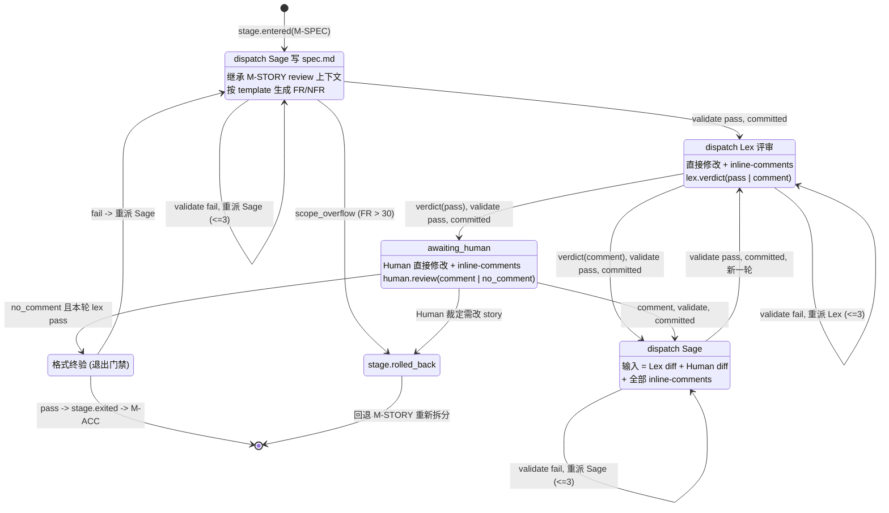
```mermaid
stateDiagram-v2
    direction TB

    [*] --> DRAFT : stage.entered(M-SPEC)

    DRAFT : dispatch Sage 写 spec.md
    DRAFT : 继承 M-STORY review 上下文
    DRAFT : 按 template 生成 FR/NFR

    DRAFT --> LEX_REVIEW : validate pass, committed
    DRAFT --> DRAFT : validate fail, 重派 Sage (<=3)
    DRAFT --> ROLLBACK : scope_overflow (FR > 30)

    LEX_REVIEW : dispatch Lex 评审
    LEX_REVIEW : 直接修改 + inline-comments
    LEX_REVIEW : lex.verdict(pass | comment)

    LEX_REVIEW --> HUMAN_REVIEW : verdict(pass), validate pass, committed
    LEX_REVIEW --> RESPOND : verdict(comment), validate pass, committed
    LEX_REVIEW --> LEX_REVIEW : validate fail, 重派 Lex (<=3)

    HUMAN_REVIEW : awaiting_human
    HUMAN_REVIEW : Human 直接修改 + inline-comments
    HUMAN_REVIEW : human.review(comment | no_comment)

    HUMAN_REVIEW --> EXIT : no_comment 且本轮 lex pass
    HUMAN_REVIEW --> RESPOND : comment, validate, committed
    HUMAN_REVIEW --> ROLLBACK : Human 裁定需改 story

    RESPOND : dispatch Sage
    RESPOND : 输入 = Lex diff + Human diff
    RESPOND : + 全部 inline-comments

    RESPOND --> LEX_REVIEW : validate pass, committed, 新一轮
    RESPOND --> RESPOND : validate fail, 重派 Sage (<=3)

    EXIT : 格式终验 (退出门禁)
    EXIT --> [*] : pass -> stage.exited -> M-ACC
    EXIT --> DRAFT : fail -> 重派 Sage

    ROLLBACK : stage.rolled_back
    ROLLBACK --> [*] : 回退 M-STORY 重新拆分
```

> validate = schema（FR/NFR 编号、章节结构）+ scope + story->spec 覆盖 trace。失败带工具原始输出重派同一作者，上限 3 次，超限升级 Human。
> scope_overflow（FR > 30）不重派压缩，直接 rolled_back 回 M-STORY 重新拆分。回退落点为 **DRAFT**（不重复 TRIAGE——triage 裁决已存在，重问违反"人类不做技术决策"）。
> 可休眠点：HUMAN_REVIEW。
> 退出硬条件：同一轮收齐 human.review(no_comment) + lex.verdict(pass) + 格式终验通过。
> Lex 评审协议与 M-STORY 的 Sage 评审同构；M-ACC 复用本节状态机（文档对象换为 acceptance.md，validate 规则见 M-ACC 节）。

### 5.2. 事件清单

```
stage.entered / command.issued / outcome.received /
verdict.passed | verdict.failed(scope_overflow|schema|trace) /
spec.committed / review.round_started /
human.review(comment|no_comment) / lex.verdict(pass|comment) /
stage.rolled_back / stage.exited
```

### 5.3. 硬规则

1. 退出 M-SPEC 需同一轮收齐 `human.review(no_comment)` + `lex.verdict(pass)` + 格式终验 `verdict.passed`。
2. 单写者纪律同 M-STORY：任一时刻只有一个 actor 持有编辑权，所有落盘变更由 Runtime 提交为独立 commit。
3. 作者响应评论的角色固定为文档作者本人（story->Scribe，spec->Sage），reviewer 不直接改稿。

## 6. M-ACC

**目的**：为 spec 中每条需求生成外部可观察、可判定 PASS/FAIL 的验收标准（acceptance.md）。

**进入条件**：M-SPEC 通过（语义评审结束 + 格式终验通过）。

### 6.1. 子状态机

状态机同 M-SPEC（§5.1），差异点：

- 文档对象：`acceptance.md`（替代 `spec.md`）
- 作者：Sage（继承 M-SPEC 上下文）
- reviewer：Lex + Human
- validate 规则：schema + scope + **AC↔FR 双向覆盖 trace**（每条 FR 至少一条 AC，每条 AC 回指存在的 FR，孤立项 = `verdict.failed(trace)`）
- 每条 AC 必须是产品级可观察断言，承接 story 行为种子，不得引入新产品行为
- 退出门禁：格式终验（同 M-SPEC）
- ROLLBACK 目标：M-SPEC 或 M-STORY（`stage.rolled_back`）

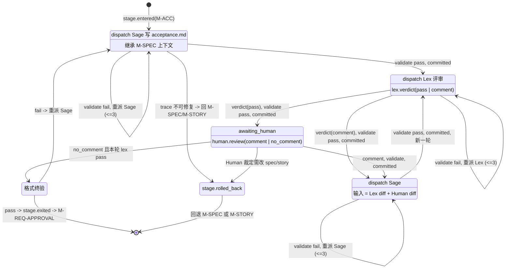
```mermaid
stateDiagram-v2
    direction TB

    [*] --> DRAFT : stage.entered(M-ACC)

    DRAFT : dispatch Sage 写 acceptance.md
    DRAFT : 继承 M-SPEC 上下文

    DRAFT --> LEX_REVIEW : validate pass, committed
    DRAFT --> DRAFT : validate fail, 重派 Sage (<=3)
    DRAFT --> ROLLBACK : trace 不可修复 -> 回 M-SPEC/M-STORY

    LEX_REVIEW : dispatch Lex 评审
    LEX_REVIEW : lex.verdict(pass | comment)

    LEX_REVIEW --> HUMAN_REVIEW : verdict(pass), validate pass, committed
    LEX_REVIEW --> RESPOND : verdict(comment), validate pass, committed
    LEX_REVIEW --> LEX_REVIEW : validate fail, 重派 Lex (<=3)

    HUMAN_REVIEW : awaiting_human
    HUMAN_REVIEW : human.review(comment | no_comment)

    HUMAN_REVIEW --> EXIT : no_comment 且本轮 lex pass
    HUMAN_REVIEW --> RESPOND : comment, validate, committed
    HUMAN_REVIEW --> ROLLBACK : Human 裁定需改 spec/story

    RESPOND : dispatch Sage
    RESPOND : 输入 = Lex diff + Human diff

    RESPOND --> LEX_REVIEW : validate pass, committed, 新一轮
    RESPOND --> RESPOND : validate fail, 重派 Sage (<=3)

    EXIT : 格式终验
    EXIT --> [*] : pass -> stage.exited -> M-REQ-APPROVAL
    EXIT --> DRAFT : fail -> 重派 Sage

    ROLLBACK : stage.rolled_back
    ROLLBACK --> [*] : 回退 M-SPEC 或 M-STORY
```

### 6.2. 事件清单

同 M-SPEC 同构，文档事件为 `acceptance.committed`；回退事件 `stage.rolled_back` 目标可为 M-SPEC 或 M-STORY。

## 7. M-REQ-APPROVAL

**目的**：Human 将 story/spec/acceptance 三件套批准为本轮需求 baseline，之后才允许进入设计/实现。

**进入条件**：story、spec、acceptance 均通过 review。

### 7.1. 子状态机

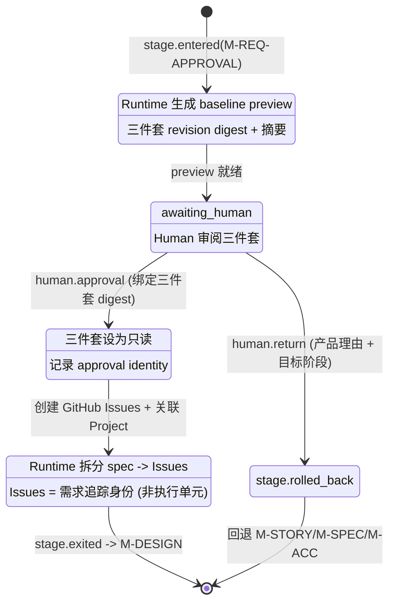
```mermaid
stateDiagram-v2
    direction TB

    [*] --> PREVIEW : stage.entered(M-REQ-APPROVAL)

    PREVIEW : Runtime 生成 baseline preview
    PREVIEW : 三件套 revision digest + 摘要

    PREVIEW --> AWAIT_HUMAN : preview 就绪

    AWAIT_HUMAN : awaiting_human
    AWAIT_HUMAN : Human 审阅三件套

    AWAIT_HUMAN --> APPROVED : human.approval (绑定三件套 digest)
    AWAIT_HUMAN --> RETURNED : human.return (产品理由 + 目标阶段)

    APPROVED : 三件套设为只读
    APPROVED : 记录 approval identity
    APPROVED --> ISSUES : 创建 GitHub Issues + 关联 Project

    ISSUES : Runtime 拆分 spec -> Issues
    ISSUES : Issues = 需求追踪身份 (非执行单元)
    ISSUES --> [*] : stage.exited -> M-DESIGN

    RETURNED : stage.rolled_back
    RETURNED --> [*] : 回退 M-STORY/M-SPEC/M-ACC
```

> 可休眠点：AWAIT_HUMAN。
> Freshness：三件套任一文档变化立即使 approval stale（digest 不匹配），下游被阻断，必须重新走 M-REQ-APPROVAL。

### 7.2. 硬规则

1. **Agent 不能批准、拒绝或代替 Human 回答**；没有 `human.approval` 事件，decide() 不产出任何进入设计/实现阶段的 command。
2. **Freshness**：三件套任一文档内容变化立即使 approval stale，下游工作被阻断。
3. Issues 是需求追踪身份，不是执行单元；实施切片（task graph）在 M-IMPL Planning 才产生，二者映射但不互相冒充。

## 8. M-DESIGN

**目的**：Archer 产出 Test Plan、Architecture、Interfaces 三文档、接口桩（interfaces.md 的可执行形态：与真实模块同路径、完整签名、行为体仅 raise + 合同 token）及宿主项目 machine contracts（至少覆盖 integration/e2e、GitHub CI、pre-commit、release version、build/artifact、发布恢复）；Prism 独立评审。这是纯技术阶段：Human 是可选 reviewer，允许缺席，意见不是批准门禁。接口桩是 ATDD 次序的基础设施：M-TEST 的 Shield 对着它们写 integration/e2e，保证实现之前即可 collect/import。machine contracts 同时独家定义测试命令（扁平 [unit]/[integration]/[e2e] 段的 run 与 run_selected，worker/dist 并发 flag 内嵌于命令字符串；D-41，见 §8.3-4）。

**进入条件**：`human.approval` 对当前三件套 digest 有效（M-REQ-APPROVAL 通过且未 stale）。

### 8.1. 子状态机

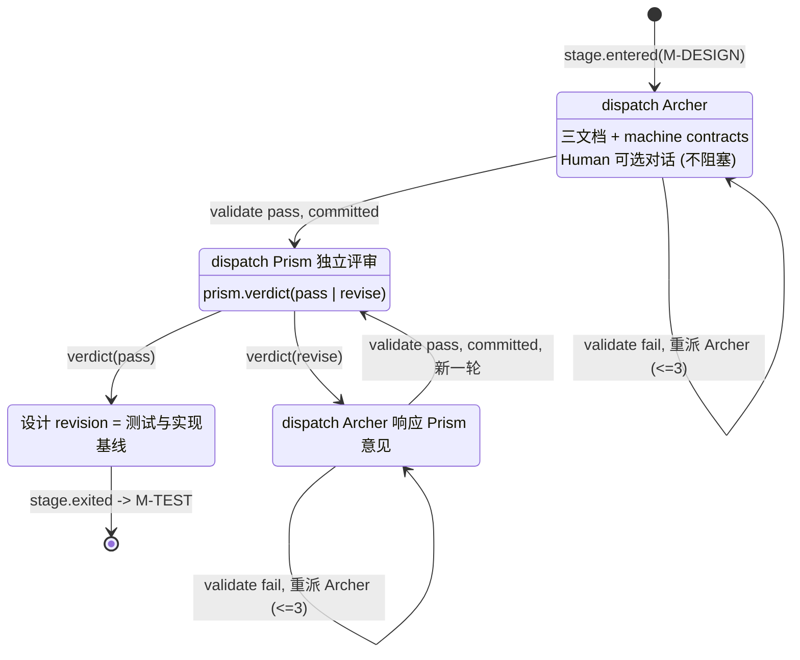
```mermaid
stateDiagram-v2
    direction TB

    [*] --> DRAFT : stage.entered(M-DESIGN)

    DRAFT : dispatch Archer
    DRAFT : 三文档 + machine contracts
    DRAFT : Human 可选对话 (不阻塞)

    DRAFT --> PRISM_REVIEW : validate pass, committed
    DRAFT --> DRAFT : validate fail, 重派 Archer (<=3)

    PRISM_REVIEW : dispatch Prism 独立评审
    PRISM_REVIEW : prism.verdict(pass | revise)

    PRISM_REVIEW --> EXIT : verdict(pass)
    PRISM_REVIEW --> RESPOND : verdict(revise)

    RESPOND : dispatch Archer 响应 Prism 意见
    RESPOND --> PRISM_REVIEW : validate pass, committed, 新一轮
    RESPOND --> RESPOND : validate fail, 重派 Archer (<=3)

    EXIT : 设计 revision = 测试与实现基线
    EXIT --> [*] : stage.exited -> M-TEST
```

> validate = 文档结构 + AC→Test Plan 分层覆盖（每条 AC 有 test layer 归属）+ 每条 integration/e2e 声明变绿条件（所依赖接口的 IF- 标识，供 M-IMPL task 变绿子集划分）+ contracts 清单完整性。
> **不等待 Human 批准**：退出只要求 validate pass + prism.verdict(pass)。Human 缺席不阻塞，建议由 Archer 技术裁量。
> **NO_DIFF peer review**（v0.5+）：当 `requires_diff` 校验对 Archer 结果触发（Archer 产出无文件 diff），不直接判 failure，而是进入 NO_DIFF_EXPLAIN->NO_DIFF_REVIEW 子状态机：Archer 解释无 diff 原因->Prism 评审解释->pass 恢复 pipeline / revise 判 `verdict.failed(no_diff_justified)`。讨论 blockquote 是物理文件变更但不是语义修改，不触发 no_diff。
> 可休眠点：无（Human 不参与门禁）。

### 8.2. 事件清单

`stage.entered` / `command.issued` / `outcome.received` / `verdict.passed|failed(schema|trace|no_diff)` / `design.committed` / `prism.verdict(pass|revise)` / `review.round_started` / `no_diff.detected` / `no_diff.explained` / `no_diff.reviewed` / `stage.exited` / `stage.rolled_back`

### 8.3. 硬规则

1. Human 无技术否决权也无到场义务；退出只要求 `verdict.passed`（程序）+ `prism.verdict(pass)`。
2. contracts 由 Archer 设计，**安装/更新/回读副作用只归 Runtime**；Devon 不得安装或修改 hook 绕过门禁。
3. 设计文档与 contracts 均有 revision/digest，修订使依赖旧 revision 的下游证据 stale。
4. **执行并发所有权与结果通道所有权（D-41，v6）**：machine contract 以扁平 [unit]/[integration]/[e2e] 段独家定义各层 run 与 run_selected 命令字符串（worker/dist 并发 flag 与 `--junitxml={result}` 结果写入 flag 均内嵌于命令字符串）；每条 run 与 run_selected 模板各含 `{result}` 占位符**恰好一次**（run_selected 另含 `{nodes}` 恰好一次）——`{result}` 指 Runtime 提供的唯一可写 JUnit XML 路径；Runtime 替换仅限声明的 `{nodes}`/`{result}` 加 cwd/argv0 解析，永不注入并发、永不注入 `--junitxml` 等 junit flag（flag 只能由 Archer 内嵌）；占位符缺失或重复 = contract_error fail-closed；run_selected 缺失 = contract_error fail-closed（不向 run 追加 nodeid、不合成调用）。

## 9. M-TEST

**目的**：Shield 按 Test Plan 对着接口桩编写 integration/e2e 测试；Runtime 独立验证"可 collect 且合法地失败（合法 Red）"；Prism 在 Runtime RED_CHECK 之后独立评审测试合约。本阶段交付的是测试资产（Red 状态），不是绿色结果——变绿是 M-IMPL 的职责。执行选择语义见 §9.0（D-41）：全量 collect、只本地执行 R2/T-DELTA、当前完整 FULL 套件（R1+R2）夜间回归归 nightly CI。

**定位（外圈合同循环）**：本阶段写下"大小两个测试循环"的**外圈**——integration/e2e 测试是实现存在之前写好的合同：先行变红、冻结为基线，M-IMPL 阶段的目标就是把这一圈全部变绿。内圈 RGR 循环见 §10（D-32）。

**进入条件**：M-DESIGN 通过（`prism.verdict(pass)` + 程序校验通过）。

**入口动作（R1 快照，v5）**：进入 M-TEST 的第一件事是 Runtime 的 baseline capture——在本 run 首个 Shield WRITE 派发之前对继承测试树做 unit+integration+e2e 全量 collect，逐节点记源/体 digest，持久化 `test.baseline_captured`（stamped baseline/tree identity + digest blob，§9.0）。capture 失败 fail-closed 路由上游/设计（不重派 Shield、不静默空置 R1）。

### 9.0. 测试节点分类与执行选择语义（canonical，D-41）

- **R1/T-HIST（历史回归节点）**：继承自既往版本的既有测试节点（unit/integration/e2e）。nightly CI 运行**当前完整 FULL 套件**（R1+R2，unit+integration+e2e——历史回归责任强调 R1/T-HIST，但 nightly 套件不是仅 R1 子集），结果在未来被取回（result fetch future），**不是当前本地门禁**；**M-TEST** 本地永不执行 R1 全量套件（M-IMPL 的 SELECT_TASK/FULL 链合法执行 R1 节点，§10.5）。
- **R2/T-DELTA（当前版本增量节点）**：新增节点、或同一 nodeid 节点源/体 digest 变化——分类恰好且仅为这两类（逐节点 digest，非整文件 digest——同文件未变兄弟节点保持 R1/T-HIST）。**M-TEST** 本地执行只限 R2/T-DELTA；合法 Red 逐节点判定。变更的 support/fixture 仍参与全量 collect/import（保证可 import），当前 R2 测试在其上执行；未变历史行为不被本地重验——其回归等待 M-IMPL FULL 链与 nightly CI。feature M-TEST 的 R2 选择集为空 = fail-closed（hotfix unit-only 显式增量声明旁路保留，§16.3.2）。
- **R1 快照（baseline capture，v5 增补）**：Runtime 在进入 M-TEST 时、本 run 首个 Shield WRITE 派发之前，对**继承测试树**（prior-to-Shield 当前工作树）执行 unit+integration+e2e 全量 collect 并逐节点记源/体 digest，持久化 `test.baseline_captured`（stamped baseline/tree identity + 逐节点 digest blob）。WRITE 之后的既有全量 COLLECT 捕获当前三层 inventory，并以该已持久化快照为唯一分类 baseline——分类 baseline 的来源是 prior-to-Shield 当前 run 的 stamped capture，不是既往事件猜测、也不是 WRITE 后可变树的事后重算。首次项目可合法捕获空集（`empty_baseline=true` 仅由成功 capture 产生；缺失 capture ≠ 空 baseline，COLLECT 时无 passed 快照 = fail-closed）。capture 中任一层 collect/import 失败 = 继承树在 Shield 写入前即不可 import，属上游/设计/合同缺陷：fail-closed 路由（verdict.failed → 上游），不静默空置 R1、不重派 Shield。WAL/replay 复用同一 stamped capture（恢复路径不得从可变工作树重新捕获）；`test.selected.baseline == test.baseline_captured.baseline_id` 可复核。
- **REMOVED（fail-closed 测试资产删除）**：baseline 历史节点缺失于本次全量 collect——不静默注销：路由 test contract defect（→Shield）并阻断 M-TEST 退出；本版无授权删除路径（未来如引入须经显式上游 contract 授权）。
- **selection identity**：一次选择的身份 = 选择依据（task IF 集合/变更影响集/delta 声明）+ 被选节点集合 + baseline/commit；上游变化使依赖它的选择与证据 stale。
- **evidence identity**：每条执行证据绑定节点身份 + selection identity + baseline/commit + attempt + actor（不变量 6/7 的具体化）；复用判定只认 identity 一致的证据。
- **FULL 链**（M-IMPL 出口门禁，详见 §10.5）：FULL = unit + integration + e2e；FULL_1（首轮）→ 失败台账 → 逐条目修复+证明 → FULL_F；新失败循环重复直至干净。
- **失败台账（event ledger）**：append-only 事件写入（WAL），重启由回放重建；条目身份 = `(node, failure_signature)`（同节点新签名新建身份），状态 `OPEN → CLASSIFIED → FIXED → PROVEN`，上游变化置 `STALE`，FULL_F 重现已 PROVEN 的同一 `(node, failure_signature)` 时确定性 `PROVEN → OPEN`（reopen，重启先前身份）；闭合转移集另含 `FIXED → OPEN`（证明失败：同签名重开重分类/重修）；未知/缺失/非法状态一律 fail-closed（不得视为干净）。
- **并发所有权与结果占位符（v6）**：测试命令由 Archer machine contract 独家定义（扁平 [unit]/[integration]/[e2e] 段的 run/run_selected，worker/dist flag 与 `--junitxml={result}` 内嵌于命令字符串，§8.3-4）；Runtime 只替换 `{nodes}`/`{result}`、解析 cwd/argv0，永不注入并发、永不注入 junit flag；run_selected 缺失 = contract_error fail-closed（不向 run 追加 nodeid、不合成调用）。
- **逐节点结果机器可读（v6）**：每次测试执行的结果权威是 `{result}` 所指 JUnit XML——testcase 节点身份必须**恰好覆盖**本次被选集合（全量 run 时 = 本次 collect 的 FULL 全集）；文件缺失/畸形、testcase 身份重复、被选节点缺席、多余节点，一律 contract_error fail-closed。stdout/stderr 仅为日志，永不作为逐节点分类依据。逐节点合法 Red 从 testcase 的 failure/error 详情推导；pass/skipped/xfailed 的处理遵循既有合法 Red 规则（被选 R2 节点 pass/skip = 非法意外通过）。FULL 链失败台账后续消费同一份归一化逐节点记录。
- **结果生命周期（v6）**：`{result}` 路径位于 Runtime temp/blob staging、按 run/command 唯一；不入树身份（不参与 tree identity/digest 与越权归属）；执行后、temp 清理前归一化持久化为 outcomes blob（事件以 `outcomes_ref` 引用）；WAL replay 发现无已持久化结果时重跑该命令——绝不把缺失结果当作通过。

### 9.1. 子状态机

```mermaid
stateDiagram-v2
    direction TB

    [*] --> DISPATCH : stage.entered(M-TEST)

    DISPATCH : Runtime 按 Test Plan 创建 Shield tasks
    DISPATCH : 每条 AC 的 layer + 变绿条件 (IF- 归属)

    DISPATCH --> WRITE : tasks 就绪

    WRITE : dispatch Shield 写测试
    WRITE : integration (happy + 关键错误/边界)
    WRITE : e2e (仅 happy path)
    WRITE : 不选新框架/不降层/不改产品代码与桩

    WRITE --> COLLECT : outcome
    WRITE --> WRITE : validate fail, 重派 Shield (<=3)

    COLLECT : Runtime 独立执行 collection/import
    COLLECT : 全部节点必须可 collect (unit + integration + e2e 三层:
    COLLECT : 继承 R1/T-HIST + 当前 R2/T-DELTA, 桩保证可 import)
    COLLECT : 变更 support/fixture 同样参与 collect/import
    COLLECT : 分类 baseline = 本 run pre-WRITE 持久化的
    COLLECT : test.baseline_captured stamped 快照 (缺失 = fail-closed)

    COLLECT --> RED_CHECK : collection 成功
    COLLECT --> WRITE : collection 失败 -> Shield

    RED_CHECK : Runtime 只执行 R2/T-DELTA (当前版本新增/修改, SELECT_R2)
    RED_CHECK : 永不本地全量套件 (R1/T-HIST 归 nightly CI)
    RED_CHECK : R1 节点 (含历史 unit) 永不进入 M-TEST 执行记录
    RED_CHECK : 失败必须逐节点为合法 Red
    RED_CHECK : 行为断言失败 / 桩合同 token 失败 / symbol 缺失
    RED_CHECK : collection/语法/fixture/import 错误 = 非法
    RED_CHECK : feature M-TEST 空 R2 选择集 = fail-closed
    RED_CHECK : (hotfix unit-only 显式增量声明旁路, §16.3.2)

    RED_CHECK --> PRISM_REVIEW : 合法 Red 成立 (red.validated 绑定当前树)
    RED_CHECK --> DIAGNOSE : 非法失败或意外通过

    DIAGNOSE : Prism 四路诊断 (Prism 评审之前完成机器回打)
    DIAGNOSE --> WRITE : 测试缺陷 -> Shield
    DIAGNOSE --> [*] : 桩/接口/架构不足 -> M-DESIGN
    DIAGNOSE --> [*] : AC/Spec 缺口 -> M-ACC/M-SPEC

    PRISM_REVIEW : dispatch Prism 审测试合约
    PRISM_REVIEW : 消费 Runtime 当前树 red.validated 证据身份
    PRISM_REVIEW : 忠于 AC + 断言落在公开出口
    PRISM_REVIEW : 只执行隔离 counterexample kill
    PRISM_REVIEW : 不把重跑普通套件当评审手段
    PRISM_REVIEW : 无伪测试 + counterexample 绑定
    PRISM_REVIEW : REVISE 携带 defect_classification 路由

    PRISM_REVIEW --> EXIT : prism.verdict(pass)
    PRISM_REVIEW --> WRITE : revise(test_defect) -> Shield
    PRISM_REVIEW --> [*] : revise(test_plan_defect) -> M-DESIGN
    PRISM_REVIEW --> [*] : revise(acceptance_defect) -> M-ACC (Human)
    PRISM_REVIEW --> [*] : revise(spec_defect) -> M-SPEC (Human)

    EXIT : Runtime 创建受控测试 commit
    EXIT : 冻结测试资产 + AC trace 闭合 (trac check trace)
    EXIT --> [*] : trace 闭合 -> stage.exited -> M-IMPL
    EXIT --> WRITE : trace 不闭合 -> Shield 补 marker (共享 <=3 预算, 超限 escalation)
```

> 退出是"测试资产齐备且 Red 合法"，不是"执行全部通过"；通过的要求推迟到 M-IMPL 出口门禁。
> **时序（D-41 v3，v5 增补入口）**：`M-TEST 入口 baseline capture(test.baseline_captured, pre-WRITE) → WRITE → 全量 COLLECT → Runtime RED_CHECK(SELECT_R2) → PRISM_REVIEW → EXIT`。非法 RED 在 Prism 之前由 Runtime 路 DIAGNOSE/WRITE 处理完毕，因此 Prism 评审消费的是**当前树**的 `red.validated` 身份证据（selection binding + 逐节点合法 Red 分类），再独立运行 counterexample kill——消除"Shield 自检、Prism 重验、Runtime RED_CHECK"三重执行同树全量的动机。
> **执行选择语义（D-41，§9.0）**：collect 是全量的（继承 R1/T-HIST + 当前 R2/T-DELTA 节点全部可 collect，变更 support/fixture 同样参与），执行是差分的——只本地执行 R2/T-DELTA 节点并逐节点判定合法 Red，**M-TEST 永不本地跑全量套件**（M-IMPL 的 SELECT_TASK/FULL 链合法执行 R1 节点，§10.5）；feature M-TEST 的 R2 选择集为空 = fail-closed（hotfix unit-only 显式增量声明旁路保留）；当前完整 FULL 套件（R1+R2）的夜间回归由 nightly CI 承担（历史回归责任强调 R1/T-HIST），结果在未来被取回（result fetch future），不构成当前本地门禁；baseline 历史节点缺失于 collect = fail-closed 测试资产删除（路由 Shield、阻断退出）。
> AC trace 闭合的依据是 `trac check trace` 程序证据：每条 required AC 至少一条测试绑定（R-1 长格式 marker `#|// AC-FRXXXX-YY@<version> TRACKS-TRACE ...`，特征词强制），无测试的 AC 与无主 marker 均为硬错误；trace 不闭合不得退出--需求追踪（trace/reach）因此必须与 M-TEST 同一 release 交付。
> 本阶段测试意外通过是异常（桩只 raise，通过通常说明测试没有真正命中桩）-> DIAGNOSE。
> "测试错还是接口错"的分流永不交给 Human；需语义判断时分派 Prism diagnostic review。
> 修复后重跑受影响测试并要求 Prism 对新 revision 重新 review。
> **defect_classification 路由**（v0.5+）：PRISM_REVIEW 的 `revise` 判定携带 `defect_classification` 字段，Runtime 据此路由回退目标：`test_defect`（默认）回 Shield WRITE 重派；`test_plan_defect` 回 M-DESIGN 让 Archer 修测试计划；`acceptance_defect` 回 M-ACC（需 Human）；`spec_defect` 回 M-SPEC（需 Human）。原则：什么产物出问题，就回退到该产物诞生的阶段。
> **NO_DIFF peer review**（v0.5+）：当 `requires_diff` 校验对 Shield 结果触发（Shield 产出无文件 diff），进入 NO_DIFF_EXPLAIN->NO_DIFF_REVIEW 子状态机（同 M-DESIGN）。讨论 blockquote 是物理文件变更但不是语义修改，不触发 no_diff；纯 self_report（无任何文件变更）才触发。
> M-TEST 共享 <=3 重派预算：WRITE 校验失败、PRISM revise(test_defect)、trace 不闭合、criteria_pack_mismatch、commit 被拒、test_defect 均消费同一计数器；第 3 次仍未通过 -> escalation (awaiting_human)。`test_plan_defect`/`acceptance_defect`/`spec_defect` 的回退不消费重派计数器（它们是上游产物缺陷，不是本阶段执行失败）。
> **doc-comment-first（v0.5+，canonical）**：Shield WRITE 的 outcome 验收第一步以本次 dispatch 前内容身份扫描全部受保护设计文档（`architecture.md`、`interfaces.md`、`test-plan.md`）的本次可归因正文变化——任一非法非 discussion 正文编辑优先按 FR-0237 整回合原子 fail-closed（不含合法评论、不保留部分结果、不进 SM-02）；仅合法新 discussion 识别限于该角色固定 COMMENTABLE_DOCS（`test-plan.md`、`interfaces.md`）并截获进入 SM-02 附属裁定（协议见 §10.4），旧线程/他人回复/无本次 delta 不触发。截获期间 outcome 暂停，不进入 COLLECT 等普通验证。

### 9.2. 事件清单

`stage.entered` / `command.issued` / `outcome.received` / `test.baseline_captured(passed|failed)`（入口 pre-WRITE R1 快照，v5） / `test.collected(passed|failed)` / `test.selected(scope=r2_delta)` / `red.validated(valid|invalid)` / `prism.verdict(pass|revise)` / `verdict.failed(baseline_defect|trace|criteria_pack_mismatch|test_defect|test_plan_defect|stub_gap|ac_gap|spec_gap|commit|no_diff_justified)` / `no_diff.detected` / `no_diff.explained` / `no_diff.reviewed` / `test.committed` / `stage.exited` / `stage.rolled_back`

（D-41 v3 时序：`red.validated` 先于 `prism.verdict`——Prism 消费当前树 RED 证据后评审。v5：`test.baseline_captured` 先于本 run 首个 Shield WRITE 派发；COLLECT 分类以该 stamped 快照为 baseline 来源。）

### 9.3. 硬规则

1. Shield 不 git add/commit/push、不判定 PASS；collection 与执行结果以 Runtime 复跑为准。
2. Shield 不修改产品代码与接口桩；桩或接口缺口走 gap advisory 回 M-DESIGN，不得在测试侧绕过。
3. 本阶段接受并要求 Red：每条测试的失败原因必须可分类为合法 Red，且 AC 层归属与 Test Plan 一致；Runtime 复跑是唯一证据来源。
4. 退出依据全部是程序证据：collection、合法 Red 分类与 `trac check trace` 闭合均由 Runtime 复跑取得；Shield 的覆盖自述（"每条 AC 都有测试"）不构成退出依据。
5. **doc-comment-first（v0.5+）**：Shield WRITE 的 outcome 验收第一步扫描全部受保护设计文档（`architecture.md`、`interfaces.md`、`test-plan.md`）的本次可归因正文变化（以 dispatch 前内容身份为基线）；任一非法非 discussion 正文编辑优先整回合原子 fail-closed 且不进 SM-02，合法新 discussion 识别限于其固定 COMMENTABLE_DOCS（`test-plan.md`、`interfaces.md`）才截获进入 SM-02 附属裁定（§10.4），旧线程/他人回复/无本次 delta 不触发。
6. **执行选择（D-41，§9.0，v5 增补；v6 结果通道）**：全量 collect（unit+integration+e2e 三层）、差分执行——M-TEST 本地只执行 R2/T-DELTA（逐节点 digest 分类：新增/同一 nodeid 节点源/体 digest 变化；未变兄弟节点保持 R1；历史 unit 节点永不进入 M-TEST 执行记录）；分类 baseline = 本 run pre-WRITE 持久化的 `test.baseline_captured` stamped 快照（缺失 = fail-closed，capture 失败 = 上游/设计 fail-closed，replay 复用同一 stamped capture）；时序上 RED_CHECK 先于 PRISM_REVIEW，非法 RED 在 Prism 前经 DIAGNOSE/WRITE 处理，Prism 消费当前树 `red.validated` 证据并只执行隔离 counterexample kill，不以重跑普通套件作为评审手段；feature M-TEST 空 R2 选择集 = fail-closed（hotfix unit-only 显式增量声明旁路保留）；当前完整 FULL 套件（R1+R2）夜间回归归 nightly CI，结果未来取回，不是当前门禁；baseline 历史节点缺失于 collect = fail-closed 测试资产删除（路由 Shield，阻断退出）。逐节点合法 Red 判定的输入是 `{result}` JUnit XML 的逐 testcase 记录（v6，§9.0）：结果文件缺失/畸形/身份重复/覆盖不精确一律 contract_error fail-closed；stdout/stderr 仅为日志。

## 10. M-IMPL

**目的**：Archer 把需求/设计基线拆成可独立验证的 implementation task graph；Devon 逐 task 以 Red→Green→Refactor 完成实现，把 Shield 的 integration/e2e 测试变绿并补齐单元测试；Prism 在 Red checkpoint 与最终 task range 两处独立评审。

**定位（内圈 RGR 循环）**：本阶段是"大小两个测试循环"的**内圈**——Devon 逐 task 走 Red→Green→Refactor，用这一圈圈的小循环去驱动外圈合同循环（Shield 的 integration/e2e 测试，见 §9）变绿。内圈保证每一步的质量，外圈负责最终验收（D-32）。

**进入条件**：M-TEST 退出条件成立（事件：`stage.exited(M-TEST)`，测试资产已冻结并进入 baseline）。

### 10.1. 子状态机

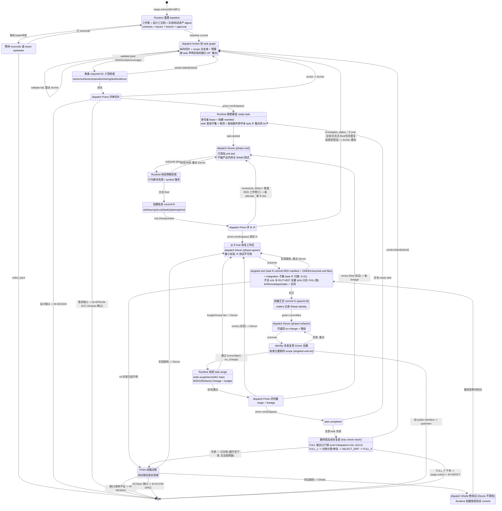
```mermaid
stateDiagram-v2
    direction TB

    [*] --> BASELINE : stage.entered(M-IMPL)

    BASELINE : Runtime 重算 baseline
    BASELINE : 三件套 + 设计三文档 + 冻结测试资产 digest
    BASELINE : contracts + Issues + branch + approval

    BASELINE --> PLANNING : baseline current
    BASELINE --> NEEDS_ATTENTION : 缺失/stale/冲突

    NEEDS_ATTENTION : 等待 reconcile 或 return upstream
    NEEDS_ATTENTION --> BASELINE : 已 reconcile
    NEEDS_ATTENTION --> [*] : rolled_back

    PLANNING : dispatch Archer 拆 task graph
    PLANNING : 纵向切片 + scope 白名单 + 预算
    PLANNING : 每 task 声明实现的接口 (IF- 集合)

    PLANNING --> ISLAND_GATE_1 : validate pass (DAG/scope/coverage)
    PLANNING --> PLANNING : validate fail, 重派 Archer

    ISLAND_GATE_1 : 每条 required AC 六项检查
    ISLAND_GATE_1 : owner/surface/composition/wiring/test/evidence

    ISLAND_GATE_1 --> PRISM_PLAN : 闭合
    ISLAND_GATE_1 --> PLANNING : verdict.failed(island)

    PRISM_PLAN : dispatch Prism 评审切片
    PRISM_PLAN --> TASK_DISPATCH : prism.verdict(pass)
    PRISM_PLAN --> PLANNING : revise -> Archer
    PRISM_PLAN --> [*] : 设计缺口 -> M-DESIGN
    PRISM_PLAN --> [*] : 需求缺口 -> M-SPEC/M-ACC (Human 确认)

    TASK_DISPATCH : Runtime 按依赖选 ready task
    TASK_DISPATCH : 单写者 lease + 创建 manifest
    TASK_DISPATCH : task 变绿子集 = 单测 + 变绿条件命中本 task IF 集合的 int
    TASK_DISPATCH --> RED : task.started

    RED : dispatch Devon (phase=red)
    RED : 只添加 unit test
    RED : 不碰产品代码与 Shield 测试

    RED --> RED_GATE : outcome (test-only diff)
    RED_GATE : Runtime 校验预期失败
    RED_GATE : 行为断言失败 / symbol 缺失
    RED_GATE --> RED_CHECKPOINT : 合法 Red
    RED_GATE --> RED : 非法 Red, 重派 Devon

    RED_CHECKPOINT : 创建私有 commit R
    RED_CHECKPOINT : refs/trac/rgr/{run}/{task}/{attempt}/red
    RED_CHECKPOINT --> PRISM_RED : red.checkpointed

    PRISM_RED : dispatch Prism 评 B..R
    PRISM_RED --> GREEN : prism.verdict(pass) 绑定 R
    PRISM_RED --> RED : revise(red_defect / 普通 RED 工件修订) -> 新 attempt、新 R slot
    PRISM_RED --> PLANNING : revise(plan_defect：R tree 全绿/无合法 Red/任务重复或类型错误) -> Archer 重拆

    GREEN : 从 R tree 恢复工作区
    GREEN : dispatch Devon (phase=green)
    GREEN : 最小实现, R 测试不可改

    GREEN --> GREEN_GATE : outcome
    GREEN_GATE : targeted unit (task R commit RED manifest + GREEN-touched unit files)
    GREEN_GATE : + integration 子集 (task IF 归属, D-41)
    GREEN_GATE : 不含 e2e 与 R1/T-HIST 全量 (e2e 只在 FULL 链)
    GREEN_GATE : lint/format/type/static + 合同
    GREEN_GATE --> GREEN_COMMIT : 全过
    GREEN_GATE --> GREEN : 实现缺陷, 重派 Devon
    GREEN_GATE --> DIAGNOSE : int 失败归因不明

    DIAGNOSE : Prism 四路诊断
    DIAGNOSE : 测试错还是实现错
    DIAGNOSE --> GREEN : 实现缺陷 -> Devon
    DIAGNOSE --> SHIELD_FIX : 测试缺陷 -> Shield
    DIAGNOSE --> [*] : 接口/架构不足 -> M-DESIGN
    DIAGNOSE --> [*] : AC/Spec 缺口 -> M-ACC/M-SPEC

    SHIELD_FIX : dispatch Shield 修测试 (Devon 不得改)
    SHIELD_FIX : Runtime 创建受控测试 commit
    SHIELD_FIX --> GREEN_GATE : 重跑受影响测试

    GREEN_COMMIT : 创建正式 commit G (parent=B)
    GREEN_COMMIT : trailers 记录 R/task identity
    GREEN_COMMIT --> REFACTOR : green.committed

    REFACTOR : dispatch Devon (phase=refactor)
    REFACTOR : 可返回 no-change + 理由
    REFACTOR --> REFACTOR_GATE : outcome

    REFACTOR_GATE : identity 未变复用 Green 证据
    REFACTOR_GATE : 有变化重跑同 scope (targeted unit+int)
    REFACTOR_GATE --> TASK_REVIEW : 通过 (committed | no_change)
    REFACTOR_GATE --> REFACTOR : 失败, 重派
    REFACTOR_GATE --> [*] : 动 public interface -> upstream

    TASK_REVIEW : Runtime 校验 task range
    TASK_REVIEW : write scope/secret/AC trace
    TASK_REVIEW : B/R/G/(Refactor) lineage + budget

    TASK_REVIEW --> PRISM_FINAL : 校验通过
    TASK_REVIEW --> GREEN : budget/scope fail -> Devon

    PRISM_FINAL : dispatch Prism 评完整 range + lineage
    PRISM_FINAL --> TASK_DONE : prism.verdict(pass)
    PRISM_FINAL --> GREEN : revise (实现) -> Devon
    PRISM_FINAL --> RED : revise (Red 测试) -> 新 lineage

    TASK_DONE : task.completed
    TASK_DONE --> TASK_DISPATCH : 还有 ready task
    TASK_DONE --> ISLAND_GATE_2 : 全部 task 完成

    ISLAND_GATE_2 : 最终孤岛闭合复查 (trac check reach)
    ISLAND_GATE_2 : FULL 链出口门禁 (unit+integration+e2e, §10.5)
    ISLAND_GATE_2 : FULL_1 -> 台账分类/修复 -> SELECT_DIFF -> FULL_F
    ISLAND_GATE_2 --> [*] : FULL_F 干净 -> stage.exited -> M-VERIFY
    ISLAND_GATE_2 --> DIAGNOSE : 失败 -> 记台账 (循环至干净, 无全链预算)
    ISLAND_GATE_2 --> PLANNING : verdict.failed(island)
```

> 绿的粒度：task 级 GREEN_GATE 只跑 targeted unit（task 不可变 R commit 的 RED artifact manifest 与 GREEN-touched unit 文件）+ task IF 归属的 integration（D-41，§9.0），不跑 e2e；FULL（unit+integration+e2e）链是 M-IMPL 出口门禁（ISLAND_GATE_2，§10.5）：FULL_1 → 失败台账 → SELECT_DIFF → FULL_F，循环至干净。
> 孤岛闭合以 `trac check reach` 为依据：从声明入口点做模块级 import 可达分析，报告不可达的生产模块；与 trace 同属需求追踪工具，消费点还有 M-VERIFY 的反 slop 门禁。
> Red 测试先于实现是程序可验证的 lineage 事实（B/R/G commit 拓扑），不是 Agent 自报。
> 单写者纪律：Devon 不得修改 Shield 的测试；测试缺陷经 DIAGNOSE→SHIELD_FIX 由 Shield 修复并产生受控测试 commit。
> 可休眠：每个 phase 边界都是事件，重启从 lineage + 事件回放恢复到精确 phase。
> 同一 attempt 重试只能得到同一 R（compare-and-set），否则产生新 attempt；旧 attempt 不被改写。
> **doc-comment-first（v0.5+，canonical）**：Devon/Shield 每个 outcome（RED/GREEN/REFACTOR/SHIELD_FIX）的验收第一步以本次 dispatch 前内容身份扫描全部受保护设计文档（`architecture.md`、`interfaces.md`、`test-plan.md`）的本次可归因正文变化，在 RED_GATE/GREEN_GATE/REFACTOR_GATE 及 DIAGNOSE 等普通验证之前执行——任一非法非 discussion 正文编辑优先按 FR-0237 整回合原子 fail-closed（不进 SM-02）；仅合法新 discussion 识别限于该角色固定 COMMENTABLE_DOCS（Devon：`architecture.md`、`interfaces.md`；Shield：`test-plan.md`、`interfaces.md`）并截获进入 SM-02 附属裁定（§10.4），旧线程/他人回复/无本次 delta 不触发。截获期间 outcome 暂停、隔离保全，闭环后以新的 dispatch/attempt 恢复同一 logical role/task/phase；旧 outcome 永不成功。

### 10.2. 事件清单

`stage.entered` / `baseline.frozen` / `taskgraph.committed` / `task.started` / `writelock.granted|released` / `red.checkpointed` / `prism.verdict(pass|revise)` / `green.committed` / `refactor.committed|no_change` / `verdict.failed(red_invalid|regression|budget|island|scope|test_defect|impl_defect)` / `test.committed` / `task.completed` / `stage.exited` / `stage.rolled_back`

D-41 附加事件（ISLAND_GATE_2 FULL 链与各门禁选择，§10.5）：`test.selected` / `full.executed` / `ledger.opened` / `ledger.transitioned` / `evidence.reused` / `evidence.staled`（REFACTOR_GATE 复用落 `evidence.reused`，GREEN_GATE/REFACTOR_GATE/RED_CHECK 选择落 `test.selected`）。

### 10.3. 硬规则

1. Devon 只能编辑 manifest 授权文件；不碰需求/设计 artifact、Shield 测试、task 状态、Git history、Issue；不 commit/push（正式 commit 均由 Runtime 创建）。
2. Red 测试先于实现是程序可验证的 lineage 事实（B/R/G commit 拓扑），不是 Agent 自报。
3. 同一 attempt 重试只能得到同一 R（compare-and-set），否则产生新 attempt；旧 attempt 不被改写。
4. 可休眠：每个 phase 边界都是事件，重启从 lineage + 事件回放恢复到精确 phase。
5. "测试错还是实现错"的分流永不交给 Human：测试缺陷由 Shield 修，实现缺陷由 Devon 修，各自产生独立的受控 commit 与证据。
6. **doc-comment-first（v0.5+）**：Devon/Shield 每个 outcome 的验收第一步扫描全部受保护设计文档（`architecture.md`、`interfaces.md`、`test-plan.md`）的本次可归因正文变化（以 dispatch 前内容身份为基线）；任一非法非 discussion 正文编辑优先整回合原子 fail-closed 且不进 SM-02，合法新 discussion 识别限于其固定 COMMENTABLE_DOCS（Devon：`architecture.md`、`interfaces.md`；Shield：`test-plan.md`、`interfaces.md`）才截获进入 SM-02 附属裁定（§10.4），旧线程/他人回复/无本次 delta 不触发。

### 10.4. doc-comment-first outcome 验收（canonical，SM-02 附属裁定记录）

**边界与目的**：Prism 对 Archer 设计文档的常规评审评论属于 `M-DESIGN / PRISM_REVIEW`，是 Prism 的正常产出，**不进入 SM-02**。SM-02 只处理 M-IMPL 的 Devon/Shield outcome（RED/GREEN/REFACTOR/SHIELD_FIX）以及 M-TEST 的 Shield WRITE outcome 中，由实现/测试 Agent 新建的合法设计讨论：它表示 Agent 发现设计与实现或测试冲突，必须先暂停本次交付，再进入普通工件/manifest/collection/gate/checkpoint/DIAGNOSE 验证。本路径不新增顶层 stage：SM-02 是附着于产生评论的 logical role/task/phase 的附属裁定记录（内部 substate），不进入顶层 stage 序列。

Prism 在 SM-02 中是技术裁定者：其**外部业务产出仍是原讨论线程中的评论**；Runtime 同时持久化结构化裁定事件，供状态机审计和路由消费。该事件不是另一份设计工件，也不改变 Prism 常规设计评审的产出边界。SM-02 与 D-37 的 `over_reach` 申诉/回滚轮次无关：非法正文编辑走 FR-0237 原子拒绝，合法讨论才走本节。

**第一步（dispatch 前内容身份审计）**：Runtime 收到 outcome 后，先以**本次 dispatch 前的文档内容身份**为基线，扫描所有受保护设计文档（`architecture.md`、`interfaces.md`、`test-plan.md`）的本次可归因正文变化——任一非法非 discussion 正文编辑按 FR-0237 在普通验证前整回合原子拒绝，不进入 SM-02。合法新 discussion 的识别限于角色固定 COMMENTABLE_DOCS：Devon 仅可评论 `architecture.md`、`interfaces.md`，Shield 仅可评论 `test-plan.md`、`interfaces.md`；其它设计文档不因本路径扩大写权限。只把本次新增且符合既有 inline-discussion 协议的增量认作合法新讨论；dispatch 前已存在的旧线程、他人回复、无本次 delta 的文档不触发截获。

- **非法非 discussion 正文编辑优先整回合原子 fail-closed**：outcome 含本次可归属的受保护设计文档正文编辑时，回滚该 dispatch 全部 Agent 可归因变化并逐字节保留 Human 与 dispatch 前既有脏改动，不保留部分代码或其他非文档成果，不进 SM-02（仅按 FR-0237 整回合原子拒绝），不 commit/checkpoint/gate/success；该规则优先于同一 outcome 中可能存在的合法讨论。按原 logical role/task/phase 的失败与 attempt 预算语义发起新 dispatch/attempt，新结果重新从本步开始。
- **合法新 discussion 才截获**：仅当结果含合法新讨论且无非法正文编辑时，暂停该 outcome 进入 SM-02 等待 Prism 裁定；随附的未验证变化不显示为成功。

**安全流程**：

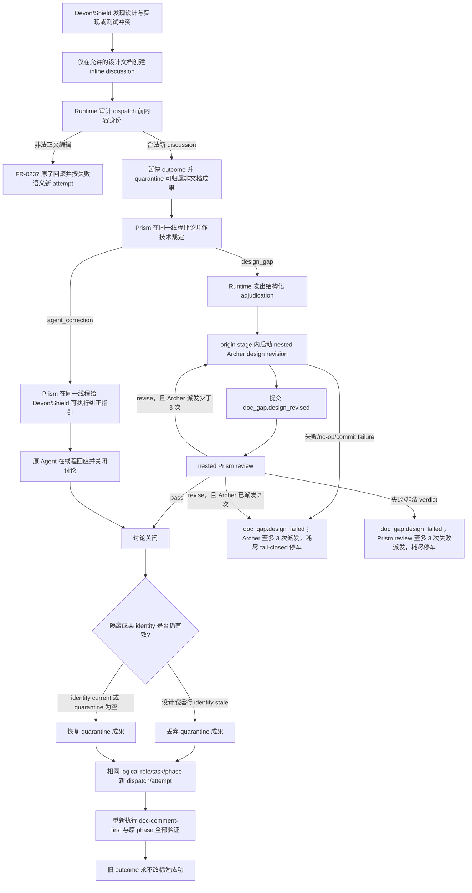
```mermaid
flowchart TD
    A[Devon/Shield 发现设计与实现或测试冲突] --> B[仅在允许的设计文档创建 inline discussion]
    B --> C[Runtime 审计 dispatch 前内容身份]
    C -->|非法正文编辑| D[FR-0237 原子回滚并按失败语义新 attempt]
    C -->|合法新 discussion| E[暂停 outcome 并 quarantine 可归属非文档成果]
    E --> F[Prism 在同一线程评论并作技术裁定]
    F -->|design_gap| G[Runtime 发出结构化 adjudication]
    G --> H[origin stage 内启动 nested Archer design revision]
    H --> I[提交 doc_gap.design_revised]
    I --> J[nested Prism review]
    J -->|pass| K[讨论关闭]
    J -->|revise，且 Archer 派发少于 3 次| H
    F -->|agent_correction| L[Prism 在同一线程给 Devon/Shield 可执行纠正指引]
    L --> M[原 Agent 在线程回应并关闭讨论]
    M --> K
    K --> N{隔离成果 identity 是否仍有效?}
    N -->|设计或运行 identity stale| O[丢弃 quarantine 成果]
    N -->|identity current 或 quarantine 为空| P[恢复 quarantine 成果]
    O --> Q[相同 logical role/task/phase 新 dispatch/attempt]
    P --> Q
    Q --> R[重新执行 doc-comment-first 与原 phase 全部验证]
    R --> S[旧 outcome 永不改标为成功]
    H -->|失败/no-op/commit failure| T[doc_gap.design_failed；Archer 至多 3 次派发，耗尽 fail-closed 停车]
    J -->|失败/非法 verdict| U[doc_gap.design_failed；Prism review 至多 3 次失败派发，耗尽停车]
    J -->|revise，且 Archer 已派发 3 次| T
```

**路由规则**：`design_gap` 由 Runtime 在 origin stage 内启动 nested Archer design-revision child workflow；它不是顶层 `stage.rolled_back(M-DESIGN)`，也不发普通 `design.committed`/`prism.verdict`，而使用 `doc_gap.design_dispatched`、`doc_gap.design_revised`、`doc_gap.design_reviewed` 与 `doc_gap.design_failed`。设计修订成功后由 nested Prism 复核。Archer 的 `design_attempts` 至多为 3（含首次，Prism `revise` 返回 Archer 也消耗此预算）；Archer failure/no-op/checkpoint failure 或 `revise` 耗尽该预算后 `design_failed`。Prism outcome failure 或非法 verdict 的 `review_attempts` 至多为 3（含首次失败派发），耗尽后同样 fail-closed；任何 `design_failed` 都不恢复 origin outcome。无 Human 技术批准。若实际发现需求边界不足（新 AC、acceptance 或 spec 变更），才按既有 `ac_gap` / `spec_gap` Human 路径处理。`agent_correction` 表示设计足够，Prism 只给原 Devon/Shield 可执行指引；原 Agent 不能直接改设计正文。

**裁定摄入协议（SM-02-ADJUDICATION marker，canonical）**：Prism 的技术裁定通过**原讨论线程内的嵌套回复**（`>>`，深度 ≥ 2）进入 Runtime，不新增公开子命令——Prism 的外部业务产出只有文档评论。marker 为单行、字段以 `|` 分隔、键值以 `=` 连接，语法固定：

```
>> **Prism:** SM-02-ADJUDICATION | route=<design_gap|agent_correction> | responsible_role=<archer|原 Agent 角色> | quarantine_id=<q-...> | threads=<T-NNN[,T-NNN...]>
```

Runtime 在每次 run loop 顶部、resume 判定之前扫描等待中（DETECTED）记录的受触及文档，仅接受**完整、语法合法、由 Prism 身份发出、嵌套于原线程、quarantine_id 与 thread 集合精确匹配当前记录、且 responsible_role 符合路由规则**（design_gap→archer；agent_correction→原 origin role）的 marker；缺字段、未知字段/route、错误角色、错误关联或多个并存 marker 一律 fail-closed 保持等待（不发事件、不改状态、不猜测语义）。**相关性先于歧义**：文档会留存历史裁定 marker，候选必须先按当前记录的 quarantine_id 过滤、malformed 错误仅在写入本记录原线程时才 fail-closed——无关历史线程永不阻塞新记录。合法 marker 发出 `doc_comment.adjudicated`（payload：record_id、quarantine_id、origin_dispatch_id、route、responsible_role、thread_ids、decision_ref），记录离开 DETECTED；`decision_ref` 与 `responsible_role` 同时投影进 doc-gap record，重放审计可验证"已接受哪个裁定"，且**首裁定为准**——同一 record 的冲突重裁定（不同 decision_ref）在重放中被拒绝，同一裁定重放为幂等空操作。同一评论重放因此天然幂等，不得重复发出裁定或创建第二个 attempt。`decision_ref` 是归一化裁定内容的 sha256 摘要，作为审计幂等键。

**resume 决策（canonical）**：线程关闭（全部记录 thread 状态 resolved）后，resume 决策必须经由 `decide_quarantine_resume()`：quarantine 为空 → restore(`empty`)；隔离成果 design/run/path 身份全部仍 current → restore(`identity_current`)；任一身份漂移或冲突 → discard(`design_stale` / `run_stale` / `content_conflict`)，fail-closed 默认丢弃。`design_stale` 的比较基线有唯一例外：没有 nested Archer revision 的 `agent_correction` 记录使用 pause-time design identity，因此 pause 后 marker 写入及其它 design drift 不导致 `design_stale`；仅 `revised_design_identity` 存在的 `design_gap` 记录以 live design identity 比较。隔离 manifest blob 同时持久化 design/run 身份锚点，供跨进程重建决策。Shield WRITE 暂停发生在 M-TEST、Devon RGR 暂停发生在 M-IMPL，两处 pause 均在同一机制下恢复；恢复派发回到 origin 的同一 logical role/task/phase（含正确 stage）。

> **User ruling (Aaron, 2026-08-21):** SM-02 裁定入口按上述 marker 协议落地（不新增 public subcommand，显式 marker 而非自然语言推断）；事件至少含 route、responsible_role、thread_ids、quarantine_id、origin_dispatch_id 与 decision_ref；幂等键为 quarantine_id + decision_ref，重放同一评论不得重复发出 `doc_comment.adjudicated` 或重复创建 attempt；resume 必须走 `decide_quarantine_resume()` 的五原因封闭集。授权记录见 GitHub issue #62（quantclaws/agent-on-tracks）。

**SM-02 状态投影**（未列出的转移不允许）：持久化 `record.state` 为 `DETECTED → DESIGN_GAP|AGENT_CORRECTION → RESTORED|DISCARDED → RESUMED`；`AWAITING_ADJUDICATION` 与 `READY_TO_RESUME` 是 lifecycle gates，非独立 `record.state`。`DESIGN_GAP` 内部的持久化 `record.revision` 为 `archer_dispatched → design_revised → prism_dispatched → prism_reviewed`，并可进入 `design_failed`。`PRISM_REVIEWED(revise)` 仅在 `design_attempts < 3` 时回到 `ARCHER_DISPATCHED`，否则进入 `DESIGN_FAILED`；Archer failure/no-op/commit failure 在 `design_attempts < 3` 时重派，Prism failure/invalid verdict 在 `review_attempts < 3` 时重派，各自耗尽后进入 `DESIGN_FAILED`。`AGENT_CORRECTION` 从裁定后等待原线程关闭，再通过 `READY_TO_RESUME` lifecycle gate。所有 nested dispatch sub-progress 在中断/重启后按 `doc_gap.*` 事件和 `command.issued` WAL 回环恢复，不越过未满足的设计修订、复核、讨论或身份条件。

- DETECTED：outcome 含本次可归属、允许评论的设计文档新讨论，且未含非法正文编辑。
- AWAITING_ADJUDICATION：Runtime 在普通结果验证前暂停该 outcome，记录来源（origin role/task/phase + 来源 dispatch/attempt）；有可归属且授权的非文档变化时同时进入隔离保全。
- DESIGN_GAP：Prism 在原讨论确认 Archer 负责的 architecture/interfaces/test-plan 缺口；Runtime 持久化裁定并在 origin stage 内启动 nested Archer design revision，随后 nested Prism 复核，无 Human 技术批准门。
- ARCHER_DISPATCHED：`doc_gap.design_dispatched(phase=design_revision)` 已写入并绑定同一 `command.issued`；pre-dispatch design identities 已持久化，checkpoint 只允许提交本次 identity 变化且属于设计范围的文件。
- DESIGN_REVISED：Archer outcome 成功、至少一个 adjudicated design document 发生变化且 checkpoint commit 成功，Runtime 发出 `doc_gap.design_revised`；普通 `design.committed` 不得发出。
- PRISM_DISPATCHED：`doc_gap.design_dispatched(phase=design_review)` 已写入并绑定 WAL；nested Prism 的失败或非法 verdict 不得默认 pass。
- PRISM_REVIEWED：nested Prism 明确给出 `pass` 或 `revise`；`revise` 仅在 Archer 的三次总派发预算（含首次）未耗尽时回到 Archer nested dispatch，`pass` 才允许进入线程关闭与 resume 判定。
- DESIGN_FAILED：nested Archer/Prism 失败、no-op、非法 verdict 或 commit failure 耗尽相应预算，或 Prism `revise` 耗尽 Archer 三次总派发预算；记录 reason，保持 `record.state=DESIGN_GAP`、`record.revision=design_failed`，origin outcome 未验证/未成功，不伪造 `RESUMED`。
- AGENT_CORRECTION：Prism 不确认设计缺口，在原讨论向原 Devon/Shield 给出可执行纠正指引；原 Agent 仅在线程回应并闭环，不能直接改设计正文。
- READY_TO_RESUME：讨论线程关闭。
- RESTORED：quarantine 为空，或 `decide_quarantine_resume()` 判定隔离成果身份仍有效并已恢复，供新的 dispatch/attempt 重新验证。
- DISCARDED：`decide_quarantine_resume()` 判定设计或运行身份变化使隔离成果 stale（`design_stale` / `run_stale` / `content_conflict`），Runtime 安全丢弃。
- RESUMED：Runtime 以相同 logical role/task/phase 发起新的 dispatch/attempt；旧 outcome 不复用、不改标为成功，新结果重新接受本步及原 phase 全部验证。

**quarantine（仅合法新 discussion 路径）**：只隔离本次 dispatch 可归属且符合该 Agent 写范围的**非文档**变化；排除文档本身、Human 修改、dispatch 前既有脏改动与越权改动；不使用工作区共享 Git index 作载体；无授权非文档变化时 quarantine 为空。闭环且新 dispatch/attempt 完成重新验证之前，隔离成果不得被 commit、checkpoint、gate、计作 task 完成或对外显示为成功。

**可观察与可审计**：合法新 discussion 路径沿用现有 quarantine 语义（隔离、恢复、丢弃同 §10.4 上文）；`trac status` 显示 doc-gap adjudication 等待/结果、origin role/task/phase 与 quarantine 状态；`trac discuss query` 显示原文档线程与回复；`trac replay`/`trac report` 回溯 detected、adjudicated、quarantined、restored-or-discarded、resumed 审计事件。非法正文路径不进 SM-02，但 `trac status`/`trac replay`/`trac report` 必须暴露失败类（over-reach）、被拒绝的文档路径、整回合回滚结果及后续新 dispatch/attempt。SM-02 事实与隔离内容身份 append-only 写入事件，不改写既有行；中断/重启后重放得到与中断前一致的等待、隔离与恢复/丢弃状态，未闭环讨论与未验证成果不越过普通门禁，重放不把旧 outcome 重复计为成功。

### 10.5. FULL 链与失败台账（canonical，D-41）

**FULL = unit + integration + e2e**，全部 task 完成后执行，是 M-IMPL 出口门禁（ISLAND_GATE_2）。术语与身份语义见 §9.0。执行序列：

1. **FULL_1（首轮全量）**：结果逐节点写入失败台账。FULL_1 干净且台账为空（零失败条目）时，同一 stamp 的执行事件直接标注 `serves_as_full_f=true` 充当 FULL_F，M-IMPL 照常出口——**绝不紧邻重复执行一次等价的 FULL_F**（干净首轮充当，与第 3 步 fallback 充当同一充当语义的退化情形）。
2. **失败台账（event ledger）**：每个失败节点一条 append-only 事件记录，条目身份 = `(node, failure_signature)`（同节点新签名新建身份、同签名重启先前身份）；状态机 `OPEN → CLASSIFIED → FIXED → PROVEN`，上游变化置 `STALE`；闭合转移集另含 `FIXED → OPEN`（证明失败）与 `PROVEN → OPEN`（reopen：FULL_F 重现已 PROVEN 的同一 `(node, failure_signature)`，重启先前身份）。分类/修复走既有 DIAGNOSE/重派路径（测试缺陷→Shield、实现缺陷→Devon、上游缺口→对应阶段）；per-agent attempt 预算照旧消费。
3. **逐条目修复-证明循环（v3）**：修复是 per bug/fix 的——每条目 `OPEN→CLASSIFIED→FIXED` 后**立即**对其运行确定性 SELECT_DIFF（按 selection identity 差分选择受影响节点）重跑证明：通过 → `FIXED→PROVEN`；同签名失败 → `FIXED→OPEN` 重分类/重修。某条目推导不出可靠选择集时回退 FULL（round=fallback_full）：该次 fallback 的结果同样逐条目落转移——通过条目 `FIXED→PROVEN`、同签名失败条目 `FIXED→OPEN`；fallback 干净可直接充当 FULL_F（事件标注充当关系）。多条目 union/batching 只在每条目的选择与证据仍可单独归因时作为可选优化，不构成规范语义。
4. **FULL_F（终局全量）**：全部条目 `PROVEN` 且无 `STALE` 后执行；出现失败则回到第 2 步——重现已 PROVEN 的同一 `(node, failure_signature)` 按 reopen 转移重启先前身份，全新 signature 才是新增条目——循环无限重复直至干净，**全链循环不设预算**（只有 per-agent 派发 attempt 预算）。FULL_F 干净 = M-IMPL 出口证据；充当情形（干净首轮 FULL_1 或 fallback FULL 已标注 `serves_as_full_f=true`）下不再另行执行 FULL_F，出口证据即该标注充当关系的同一执行事件。

**台账纪律（WAL/replay/fail-closed）**：台账条目以 append-only 事件写入（write-ahead），重启由事件回放重建台账状态；未知状态、缺失条目、非法转移一律 fail-closed（不得视为干净、不得跳过 FULL_F）。selection identity 与 evidence identity 绑定每条记录；上游变化使相关 selection/evidence `STALE`。台账的失败签名与逐节点状态消费同一份归一化逐节点结果记录（`outcomes_ref` blob，v6 §9.0——FULL/SELECT_DIFF 执行经 `{result}` JUnit 通道产出，stdout/stderr 不作分类权威）。

**M-VERIFY 复用**：candidate 相对干净 FULL_F 未漂移（identity 一致）时复用之，随后进入既有候选 CI 门禁等待 `ci.run_observed(passed)` API 回读，不重复本地全量（§11）——该回读是 ordinary candidate CI 证据，与推迟实现的 nightly 结果取回（result fetch future）无关。

## 11. M-VERIFY

**目的**：冻结 release candidate，跑完整本地权威质量链 + GitHub CI + 版本/构建物验证，Prism 做整体一致性复审。

**进入条件**：M-IMPL 通过（事件：`stage.exited(M-IMPL)`）。

### 11.1. 子状态机

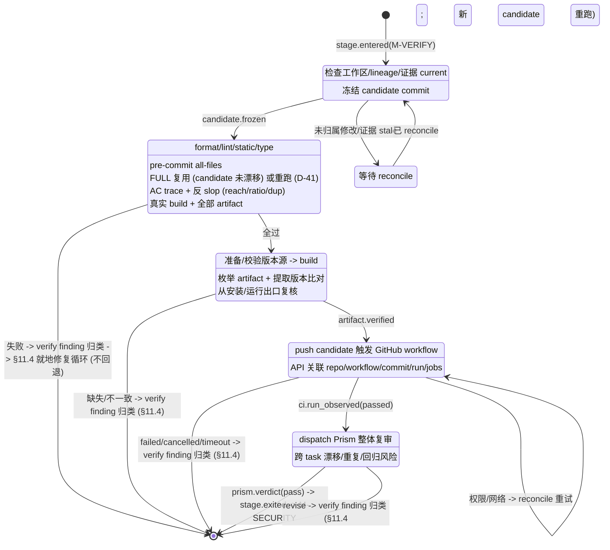
```mermaid
stateDiagram-v2
    direction TB

    [*] --> FREEZE : stage.entered(M-VERIFY)

    FREEZE : 检查工作区/lineage/证据 current
    FREEZE : 冻结 candidate commit
    FREEZE --> LOCAL_GATES : candidate.frozen
    FREEZE --> NEEDS_ATTENTION : 未归属修改/证据 stale

    NEEDS_ATTENTION : 等待 reconcile
    NEEDS_ATTENTION --> FREEZE : 已 reconcile

    LOCAL_GATES : format/lint/static/type
    LOCAL_GATES : pre-commit all-files
    LOCAL_GATES : FULL 复用 (candidate 未漂移) 或重跑 (D-41)
    LOCAL_GATES : AC trace + 反 slop (reach/ratio/dup)
    LOCAL_GATES : 真实 build + 全部 artifact

    LOCAL_GATES --> VERSION_VERIFY : 全过
    LOCAL_GATES --> [*] : 失败 -> verify finding 归类 -> §11.4 就地修复循环 (不回退)

    VERSION_VERIFY : 准备/校验版本源 -> build
    VERSION_VERIFY : 枚举 artifact + 提取版本比对
    VERSION_VERIFY : 从安装/运行出口复核

    VERSION_VERIFY --> CI : artifact.verified
    VERSION_VERIFY --> [*] : 缺失/不一致 -> verify finding 归类 (§11.4)

    CI : push candidate 触发 GitHub workflow
    CI : API 关联 repo/workflow/commit/run/jobs

    CI --> PRISM_FINAL : ci.run_observed(passed)
    CI --> CI : 权限/网络 -> reconcile 重试
    CI --> [*] : failed/cancelled/timeout -> verify finding 归类 (§11.4)

    PRISM_FINAL : dispatch Prism 整体复审
    PRISM_FINAL : 跨 task 漂移/重复/回归风险

    PRISM_FINAL --> [*] : prism.verdict(pass) -> stage.exited -> M-SECURITY
    PRISM_FINAL --> [*] : revise -> verify finding 归类 (§11.4; 新 candidate 重跑)
```

> 所有 gate 必须对**同一** candidate PASS；不存在"部分基于旧 commit 的绿色"。
> CI 结果以 API 回读为准，永不采信 Agent 转述。
> **FULL 复用（D-41，§10.5）**：candidate 相对 M-IMPL 干净 FULL_F 未漂移（identity 一致）时复用之，**不重复本地全量**；漂移/stale 才按 LOCAL_GATES 重跑。CI 证据是既有候选门禁的 `ci.run_observed` API 回读（ordinary candidate CI readback）——nightly 结果取回通道本版不实现（result fetch future），两者不得混同；nightly CI 运行当前完整 FULL 套件（R1+R2）不构成当前本地门禁；测试命令由 Archer machine contract 独家定义（并发 flag 与 `--junitxml={result}` 内嵌于命令字符串），Runtime 永不注入并发与 junit flag、run_selected 缺失即 contract_error fail-closed（不合成调用）。
> 局部 test selector 只供开发反馈；全量语义以 §9.0/§10.5 为准——"与本次需求无关"既不是排除历史测试的理由，也不是本地重复全量的理由（历史测试仍受 nightly CI 全量覆盖与未来取回约束）。

### 11.2. 事件清单

`stage.entered` / `candidate.frozen` / `check.executed(各 gate)` / `evidence.reused(kind=full_f)` / `ci.run_observed(passed|failed)` / `artifact.verified` / `prism.verdict(pass|revise)` / `verdict.failed(...)` / `stage.exited` / `stage.rolled_back`

### 11.3. 硬规则

1. 所有 gate 必须对**同一** candidate PASS；不存在"部分基于旧 commit 的绿色"。
2. CI 结果以 API 回读为准，永不采信 Agent 转述。
3. **FULL 复用与并发所有权（D-41，v6）**：candidate 相对 M-IMPL 干净 FULL_F 未漂移时复用之，不重复本地全量；CI 证据以既有候选 CI 门禁的 `ci.run_observed` API 回读为准，回读通过才退出——nightly 结果取回是明确推迟的独立事项（result fetch future），不是本门禁输入；漂移/stale 才重跑 LOCAL_GATES。测试命令由 Archer machine contract 独家定义（扁平 [unit]/[integration]/[e2e] 段的 run/run_selected，并发 flag 与 `--junitxml={result}` 内嵌于命令字符串），Runtime 只替换 {nodes}/{result}、永不注入并发与 junit flag；run_selected 缺失 = contract_error fail-closed（不向 run 追加 nodeid、不合成调用）；FULL 链逐节点结果消费 `{result}` JUnit 归一化记录（§9.0 v6），覆盖不精确/缺失/畸形 = contract_error fail-closed。
4. **自动路径不回退（2026-08-31 讨论收敛）**：M-VERIFY 失败时 Runtime 的**自动路由**不回退 M-DESIGN/M-PLANNING——候选已建立在实现基线上，自动回退重规划的代价大于就地修复。verify finding 一律经 §11.4 就地修复循环产生**新 candidate** 重走 M-VERIFY；不可修复缺陷按 §11.4 判据登记 known issue（安全 finding 除外，见 §12.3）。凭据/网络/环境类失败不产生 finding，走 `needs_attention` + 恢复后原 candidate 续跑。**本规则只约束自动路径**——Human 随时可经 §11.5 逃生门回拨指针。

### 11.4. 就地修复循环与 Known Issue（2026-08-31 讨论收敛）

**成本效率原则**：发布闭环内的缺陷默认**就地修复、不后退**。分类只用于决定"由谁就地修"，不产生阶段回退。

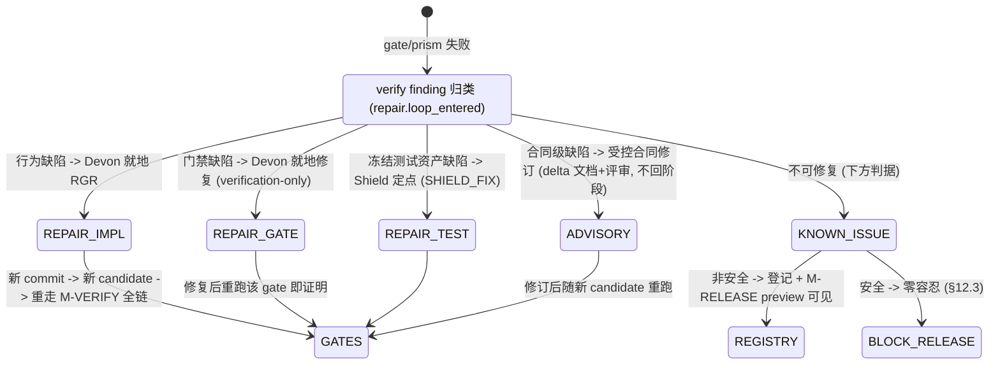
```mermaid
stateDiagram-v2
    [*] --> CLASSIFY : gate/prism 失败
    CLASSIFY : verify finding 归类 (repair.loop_entered)
    CLASSIFY --> REPAIR_IMPL : 行为缺陷 -> Devon 就地 RGR
    CLASSIFY --> REPAIR_GATE : 门禁缺陷 -> Devon 就地修复 (verification-only)
    CLASSIFY --> REPAIR_TEST : 冻结测试资产缺陷 -> Shield 定点 (SHIELD_FIX)
    CLASSIFY --> ADVISORY : 合同级缺陷 -> 受控合同修订 (delta 文档+评审, 不回阶段)
    CLASSIFY --> KNOWN_ISSUE : 不可修复 (下方判据)
    REPAIR_IMPL --> GATES : 新 commit -> 新 candidate -> 重走 M-VERIFY 全链
    REPAIR_GATE --> GATES : 修复后重跑该 gate 即证明
    REPAIR_TEST --> GATES
    ADVISORY --> GATES : 修订后随新 candidate 重跑
    KNOWN_ISSUE --> REGISTRY : 非安全 -> 登记 + M-RELEASE preview 可见
    KNOWN_ISSUE --> BLOCK_RELEASE : 安全 -> 零容忍 (§12.3)
```

- **行为缺陷**（CI/FULL 重跑失败、Prism finding 指向产品代码）：Devon 在**当前 run 内** RED-first 就地修复——新增 unit 层回归测试复现缺陷（不修改冻结 int/e2e：行为合同未变，冻结测试正是"修复不改变行为合同"的回归保护）；GREEN 修复；新 commit 产生新 candidate SHA，旧 candidate 的 FULL_F/CI/preview/Human 决定全部 stale，完整重走 M-VERIFY。
- **门禁缺陷**（lint、SCA 报 CVE、build/扫描失败）：修的是依赖版本或配置，**没有天然的 RED 测试可写**——verification-only：修复后重跑该 gate 通过即证明，不人造无意义失败测试。依赖漏洞由 Archer 以**咨询派发**评估替代方案（换版本/换库），建议注入 Devon 修复 assignment；Archer 参与不等于阶段回退。
- **冻结测试资产缺陷**（Prism finding 分类为 `test_defect`）：Shield 定点修订（SHIELD_FIX 通道），禁止全量重写；修复本身不需要新行为断言时不得改动 int/e2e。
- **合同级缺陷**（含安全合同错位）：允许**受控合同修订**——delta 文档 + 评审，不回阶段；修订后随新 candidate 重跑。
- **不可修复判据**（满足其一即 known issue 候选）：
  1. 就地修复 attempt 预算（默认 3）穷尽且 Prism 复审确认归因不变；
  2. 修复需变更冻结 interfaces/AC 且超出受控合同修订可承载范围；
  3. 外部依赖无可用修复（库无补丁版本；换库/换版本超出本版范围）。
- **Known Issue 政策**：仅适用于**产品质量缺陷**。Prism 确认归因后 Runtime 登记 GitHub issue（`known-issue` 标签、关联 candidate SHA 与失败证据）；**必须在 M-RELEASE preview 中列出**——Human 带病发布需知情同意，preview 未列出的 known issue 不允许存在；M-MILESTONE 的 release trace 以 waiver 语义豁免绑定 AC 并转下版 backlog；下版 triage 必须消费。
- **排除项**：**发布机制本身的失败**（artifact/tag/CI/registry 故障）不适用 known issue——修好或放弃发布，不存在"带病发布"。
- **与 hotfix 的边界**：run 内就地修复**不起** hotfix run——hotfix 是发布后通道（`fix/{issue}` 独立分支 run），且单活跃 run 原则（§16.3.7）禁止并发第二个开发活动。
- **M-PUBLISH/M-MILESTONE 同原则**：外部操作/归档失败就地处理（reconcile、retry_tail），不后退；产品质量类残留无法修复的按 Known Issue 政策带病发布；已成功的外部副作用永不回滚、不重复。
- **逃生门**：known issue 是默认出口，但 Human 随时可用 §11.5 逃生门回拨指针替代。

### 11.5. Human 逃生门：指针回拨（用户要求 2026-08-31）

**原则**：就地修复是默认的低成本路径，但 **Runtime 永不拥有阶段指针的最终决定权**。Human 在任何时候（可咨询 Agent，其建议仅为 advisory）可以把 run 的阶段指针回拨到任一上游 canonical 阶段。

1. **形式与权限**：`trac return --to <stage>` 扩展为通用逃生门——可从**任意**阶段（含 M-VERIFY/M-SECURITY/M-RELEASE/M-PUBLISH/M-MILESTONE）回拨到任一上游 canonical 阶段。actor 必须为 Human，落 append-only 事件（`human.return`：actor/from/to/reason）。Runtime 不得以任何自动策略阻止 Human 回拨；自动路由（§11.4 就地修复）只是默认路径，不限制逃生门。
2. **线性化、迟到 outcome 隔离与证据失效（回拨的核心语义）**：Runtime 必须先在 writer lock 内建立 escape barrier（记录 cutover sequence、quiesce/取消在飞 dispatch），再移动指针；barrier 前派发而在其后到达的 outcome 一律写为可审计的 `escape.late_outcome`/quarantine，**不得** checkpoint、publish 或覆盖已回拨的 State。指针从 S 回拨到 T 后，T 之后产生的全部阶段证据（candidate 冻结、FULL_F 复用、CI 绑定、安全评估、preview、release 决定）经 `evidence.staled(reason=human_return)` 显式失效——append-only 不删除，replay 可见完整回拨历史；重新进入时按现行基线重验，不得复用已失效证据。测试资产冻结随回拨目标按既有规则解除（回拨到 M-TEST 之前才可修订已冻结测试）。
3. **不可逆外部副作用**：回拨跨越已执行的 M-PUBLISH 操作（merge/tag/artifact/release）时，逃生门**永不撤销**真实外部事实；Runtime 必须先报告已执行操作清单、Human 显式确认后才移动指针；已执行操作落为外部事实，重新进入 M-PUBLISH 时经 reconcile 识别（新 candidate/新版本语义下不与旧副作用混淆）。
4. **Agent 咨询**：Human 回拨前可要求 Agent（如 Prism/Archer）出具影响评估——评估仅为 advisory、不改变任何状态；决定与责任归 Human。
5. **与架构级安全问题的衔接**：M-SECURITY 发现架构级不可修复问题时发布阻断，人工补救的正式通道即本逃生门——Human（可咨询 Agent）决定回拨到 M-DESIGN/M-SPEC 重新设计，或终止发布努力；v0.8 不为此设自动化机制（§12.3）。
6. **终止出口（轻量，v0.8 实现）**：Human 可经 `trac abandon --reason TEXT`（待实现 foundation task，同步 USAGE/TRAC_SUBCOMMANDS）把 run 以 `run.completed(terminal_state="cancelled")` 终止：不删除任何证据（全程可 replay/report 审计）、不触碰已创建 issues 与分支、不执行任何外部副作用；终态 run 不再接受 `trac run` 推进，也不消耗任何 Agent 预算。需要重做时以 `trac start` 开新 run；已创建 issues 与分支的复用/处置由 Issue 映射机制与 Human 决定，逃生门本身不做清理。

## 12. M-SECURITY

**目的**：程序安全扫描 + Judge 语义安全审计；findings 四路归因。

**进入条件**：M-VERIFY 通过（事件：`stage.exited(M-VERIFY)`）。

### 12.1. 子状态机

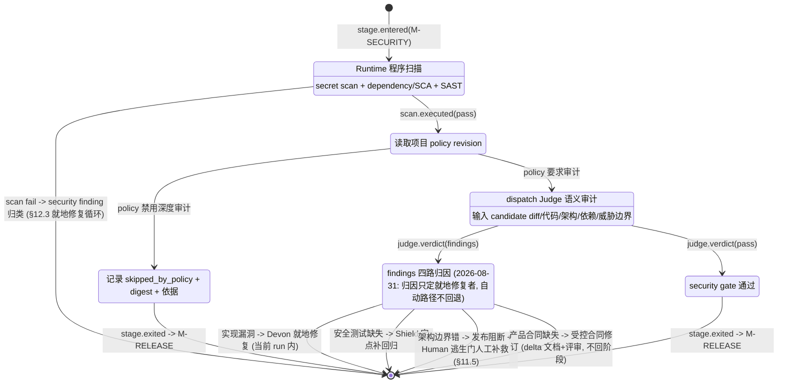
```mermaid
stateDiagram-v2
    direction TB

    [*] --> SCAN : stage.entered(M-SECURITY)

    SCAN : Runtime 程序扫描
    SCAN : secret scan + dependency/SCA + SAST

    SCAN --> POLICY_CHECK : scan.executed(pass)
    SCAN --> [*] : scan fail -> security finding 归类 (§12.3 就地修复循环)

    POLICY_CHECK : 读取项目 policy revision
    POLICY_CHECK --> SKIPPED : policy 禁用深度审计
    POLICY_CHECK --> JUDGE : policy 要求审计

    SKIPPED : 记录 skipped_by_policy + digest + 依据
    SKIPPED --> [*] : stage.exited -> M-RELEASE

    JUDGE : dispatch Judge 语义审计
    JUDGE : 输入 candidate diff/代码/架构/依赖/威胁边界

    JUDGE --> EXIT : judge.verdict(pass)
    JUDGE --> ATTRIBUTE : judge.verdict(findings)

    ATTRIBUTE : findings 四路归因 (2026-08-31: 归因只定就地修复者, 自动路径不回退)
    ATTRIBUTE --> [*] : 实现漏洞 -> Devon 就地修复 (当前 run 内)
    ATTRIBUTE --> [*] : 安全测试缺失 -> Shield 定点补回归
    ATTRIBUTE --> [*] : 架构边界错 -> 发布阻断 + Human 逃生门人工补救 (§11.5)
    ATTRIBUTE --> [*] : 产品合同缺失 -> 受控合同修订 (delta 文档+评审, 不回阶段)

    EXIT : security gate 通过
    EXIT --> [*] : stage.exited -> M-RELEASE
```

> 修复后必须重过受影响的 M-IMPL/M-TEST、**完整 M-VERIFY** 与 Judge 复审。
> critical/high finding 不可 waiver；涉及认证/权限/secret/支付/敏感数据的变更不得静默跳过。

### 12.3. 安全修复就地循环、零 Known Issue 与人工补救（2026-08-31 讨论收敛）

**前提**：M-SECURITY 整体保持 policy-gated 可选——tracks 优先交付可上线产品，安全深度评审按项目 policy 启用；单机/无重大安全面的项目可经 policy 合法跳过。

- **实现漏洞**：Devon 当前 run 内就地修复——行为缺陷 RED-first（新增 unit 层回归测试复现漏洞）→ GREEN；新 candidate 重走 M-SECURITY（并重走 M-VERIFY，因 candidate SHA 变化）。**一般不修改冻结 int/e2e 测试**：行为合同未变时冻结测试没有改动理由；如 Archer 判定漏洞只能在集成层观察，以 Shield 定点**新增**（非修改）回归测试。
- **依赖漏洞**（SCA 报告的 CVE）：Archer 以咨询派发评估替代方案（换版本/换库），产出建议注入 Devon 修复 assignment——Archer 参与不等于阶段回退；升级后流水线随新 commit 产生新 candidate 重跑。
- **合同级安全缺陷**（漏洞在 AC/接口断言的行为本身）：允许受控合同修订（delta 文档+评审），不回阶段。
- **零 Known Issue**：安全 finding 必须修复，**不允许以 known issue 带病发布**；M-SECURITY 未通过（含 unknown/畸形策略）时 `release.decided` 一律被 Runtime 拒绝（硬门禁）。
- **架构级不可修复**（不换架构就修不了）：发布阻断，run 停于 M-SECURITY。此类 case 罕见，**v0.8 不设自动化机制**——人工补救的正式通道是 Human 逃生门（§11.5）：Human（可咨询 Agent）决定回拨指针重新设计或终止发布努力。
- **修复循环预算**：就地修复 attempt 预算（默认 3）穷尽仍无法修复 → 按不可修复处理（安全一律为发布阻断）。
- **通道边界**：与 §11.4 相同——run 内修复不起 hotfix run；hotfix 是发布后通道。
- **暂缓项**：M-DESIGN 后的架构级安全评审补丁（设计期安全门禁 + 声明依赖 SCA 预检）**推迟到后续版本**——先交付可上线产品，安全评审按项目 policy 启用。

### 12.2. 事件清单

`stage.entered` / `scan.executed` / `judge.verdict(pass|findings)` / `security.skipped_by_policy` / `verdict.failed(security)` / `stage.exited` / `stage.rolled_back`

## 13. M-RELEASE（Human 发布门禁）

**目的**：Human 授权不可逆发布副作用。

**进入条件**：M-SECURITY 通过（或合法 policy skip）。

### 13.1. 子状态机

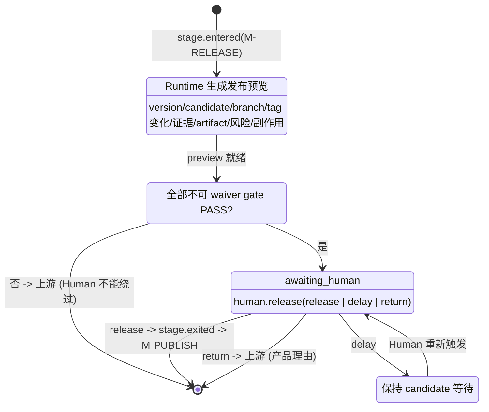
```mermaid
stateDiagram-v2
    direction TB

    [*] --> PREVIEW : stage.entered(M-RELEASE)

    PREVIEW : Runtime 生成发布预览
    PREVIEW : version/candidate/branch/tag
    PREVIEW : 变化/证据/artifact/风险/副作用

    PREVIEW --> GATE_CHECK : preview 就绪

    GATE_CHECK : 全部不可 waiver gate PASS?
    GATE_CHECK --> AWAIT_HUMAN : 是
    GATE_CHECK --> [*] : 否 -> 上游 (Human 不能绕过)

    AWAIT_HUMAN : awaiting_human
    AWAIT_HUMAN : human.release(release | delay | return)

    AWAIT_HUMAN --> [*] : release -> stage.exited -> M-PUBLISH
    AWAIT_HUMAN --> DELAYED : delay
    AWAIT_HUMAN --> [*] : return -> 上游 (产品理由)

    DELAYED : 保持 candidate 等待
    DELAYED --> AWAIT_HUMAN : Human 重新触发
```

> candidate/artifact/证据/发布计划任一变化 → 旧 approval stale，必须新 preview。
> 可休眠点：AWAIT_HUMAN、DELAYED。

### 13.2. 硬规则

1. Agent 可总结证据，不能代替 Human 作发布决定，也不得把技术风险选择推给 Human。
2. Human 不能用发布确认绕过失败的门禁。

## 14. M-PUBLISH

**目的**：Runtime 执行不可逆外部副作用（merge、tag、artifact 发布、GitHub Release、部署）；幂等 + write-ahead + reconcile。

**进入条件**：M-RELEASE 通过（`human.release(release)` 绑定 preview digest）。

### 14.1. 子状态机

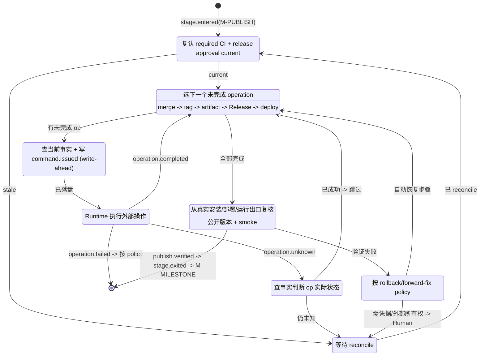
```mermaid
stateDiagram-v2
    direction TB

    [*] --> RECONFIRM : stage.entered(M-PUBLISH)

    RECONFIRM : 复认 required CI + release approval current
    RECONFIRM --> OPS_LOOP : current
    RECONFIRM --> NEEDS_ATTENTION : stale

    NEEDS_ATTENTION : 等待 reconcile
    NEEDS_ATTENTION --> RECONFIRM : 已 reconcile

    OPS_LOOP : 选下一个未完成 operation
    OPS_LOOP : merge -> tag -> artifact -> Release -> deploy

    OPS_LOOP --> ISSUE_CMD : 有未完成 op
    OPS_LOOP --> VERIFY_PUBLISH : 全部完成

    ISSUE_CMD : 查当前事实 + 写 command.issued (write-ahead)
    ISSUE_CMD --> EXECUTE_OP : 已落盘

    EXECUTE_OP : Runtime 执行外部操作
    EXECUTE_OP --> OPS_LOOP : operation.completed
    EXECUTE_OP --> RECONCILE : operation.unknown
    EXECUTE_OP --> [*] : operation.failed -> 按 policy

    RECONCILE : 查事实判断 op 实际状态
    RECONCILE --> OPS_LOOP : 已成功 -> 跳过
    RECONCILE --> NEEDS_ATTENTION : 仍未知

    VERIFY_PUBLISH : 从真实安装/部署/运行出口复核
    VERIFY_PUBLISH : 公开版本 + smoke

    VERIFY_PUBLISH --> [*] : publish.verified -> stage.exited -> M-MILESTONE
    VERIFY_PUBLISH --> RECOVER : 验证失败

    RECOVER : 按 rollback/forward-fix policy
    RECOVER --> OPS_LOOP : 自动恢复步骤
    RECOVER --> NEEDS_ATTENTION : 需凭据/外部所有权 -> Human
```

> tag、Release、registry publish、merge、部署不得由 Agent 执行或用聊天文本模拟。
> 中断后逐项 reconcile：已成功 operation 不重复执行；不重打不同 tag、不覆盖不可变 artifact。
> 全部必需操作 + 公开版本验证成功前，状态保持 `publishing`/`needs_attention`，不得标记完成。

### 14.2. 事件清单

`stage.entered` / `command.issued` / `operation.completed|failed|unknown` / `publish.verified` / `stage.exited`

## 15. M-MILESTONE

**目的**：trace 最终闭包 + 幂等收尾归档；可选 Librarian 知识提炼。

**进入条件**：M-PUBLISH 通过（`publish.verified`）。

### 15.1. 子状态机

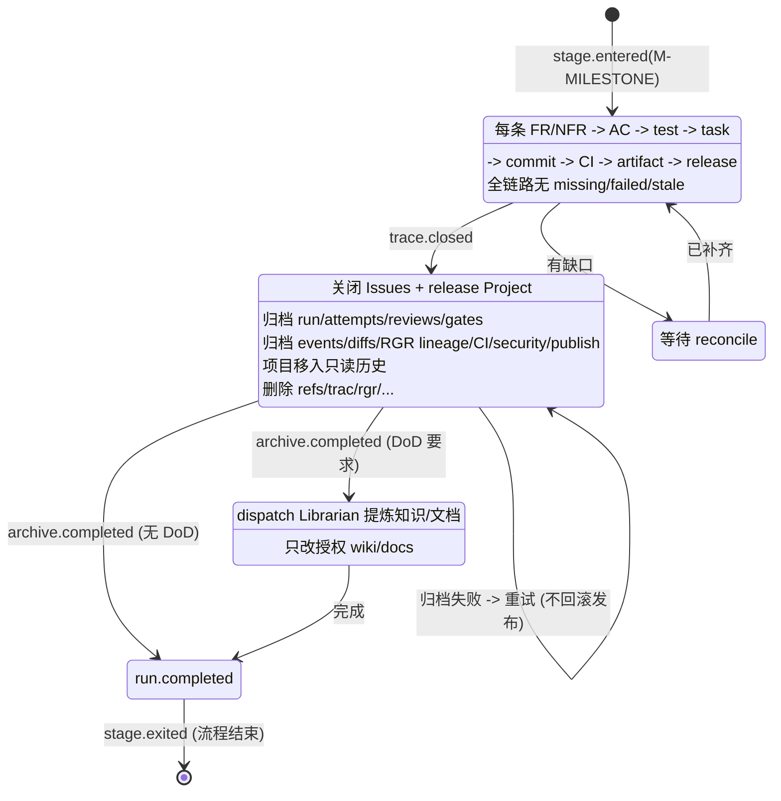
```mermaid
stateDiagram-v2
    direction TB

    [*] --> TRACE_CLOSE : stage.entered(M-MILESTONE)

    TRACE_CLOSE : 每条 FR/NFR -> AC -> test -> task
    TRACE_CLOSE : -> commit -> CI -> artifact -> release
    TRACE_CLOSE : 全链路无 missing/failed/stale

    TRACE_CLOSE --> ARCHIVE : trace.closed
    TRACE_CLOSE --> NEEDS_ATTENTION : 有缺口

    NEEDS_ATTENTION : 等待 reconcile
    NEEDS_ATTENTION --> TRACE_CLOSE : 已补齐

    ARCHIVE : 关闭 Issues + release Project
    ARCHIVE : 归档 run/attempts/reviews/gates
    ARCHIVE : 归档 events/diffs/RGR lineage/CI/security/publish
    ARCHIVE : 项目移入只读历史
    ARCHIVE : 删除 refs/trac/rgr/...

    ARCHIVE --> LIBRARIAN : archive.completed (DoD 要求)
    ARCHIVE --> EXIT : archive.completed (无 DoD)
    ARCHIVE --> ARCHIVE : 归档失败 -> 重试 (不回滚发布)

    LIBRARIAN : dispatch Librarian 提炼知识/文档
    LIBRARIAN : 只改授权 wiki/docs
    LIBRARIAN --> EXIT : 完成

    EXIT : run.completed
    EXIT --> [*] : stage.exited (流程结束)
```

> 发布成功但归档/清理失败 → 保持 `closing` 重试；不得回滚真实发布事实或创建第二次发布。

### 15.2. 事件清单

`stage.entered` / `trace.closed` / `archive.completed` / `run.completed` / `stage.exited`

## 16. Bug Fix / Hotfix 变体

### 16.1. 适用性与入口（v0.6）

1. `bug_fix` 只适用于目标版本（已发布或开发中）相对既有 approved Spec/AC 的**实现偏差**。入口先过 HOTFIX-TRIAGE 子状态机（§16.4）：程序预检（issue 必须为 bug 类型；宿主 bug template 提供版本与对应 FR/NFR 字段，均可选——终端用户无法知道编号，字段仅作辅助、不完全采信）+ Sage 语义锚定（依据 issue 场景/症状与可选字段，在目标版本及历史版本的 spec/acc 中锚定对应 AC）。锚定不成立 → 按 feature 处理以补齐程序行为规范（§16.4 FEATURE_ROUTE）。
2. 入口命令 `trac hotfix <issue> --scenario post-release|dev`（v0.6 用户裁定）：`<issue>` 是宿主 repo 的 GitHub issue 号，作为该 hotfix 的需求追踪身份（对应 feature release 中 M-REQ-APPROVAL 产生的 Issues）；`--scenario` 显式声明场景（`post-release` = 场景 A，`dev` = 场景 B），必填——缺省时 Runtime 询问 Human，不从 issue 推断。Runtime 建立 hotfix run 并运行 §16.4 入口 triage；锚定确认后创建隔离 `fix/{issue}` 分支、直接 `stage.entered(M-DESIGN)`；不走 M-STORY/M-SPEC/M-ACC/M-REQ-APPROVAL——需求基线继承目标版本已批准的三件套与设计基线（source approval，不重新批准）。
3. 两个场景，按修复的受众划分（`--scenario` 的取值即场景声明；场景是产品决定，由 Human 在入口指定）：
   - **场景 A · `post-release` · 已发布版本 hotfix**：目标是为全体用户发布 hotfix。`fix/{issue}` 始终从 main checkout；修复后 merge 回 main；存在活跃 release 分支时，同一修复还须 merge 进活跃 release 分支（防止下个版本重新携带缺陷）；冲突 → `needs_attention`。
   - **场景 B · `dev` · 开发中版本 hotfix**：目标是供开发者自己与 alpha/beta 用户使用。`fix/{issue}` 从当前活跃 release 分支 checkout；修复后 merge 回活跃分支；不直接 merge main——修复随活跃分支的正式发布一并进入 main（该合并不属于 hotfix 流程）；不建新发布机制，修复经在开发版本的既有 pre-release/开发渠道到达 alpha/beta。

> **Aaron:** 如何判断是新行为？如果能在过往版本中找到 spec/acc，则是 bug，否则是新 feature. 但难度也在于此，如何找到对应的 spec/acc? 谁来完成此任务？
>> **Maestro:** 判定是程序验证 + 语义锚定的组合，不需要 Human 做技术判断：入口处 Runtime 程序化验证 issue 能定位到目标版本（issue 元数据/指认的版本与 AC 引用，缺失则要求补全后重试）；进入 M-DESIGN 后由 Archer 在 delta 设计中锚定所偏离的 FR/AC（引用目标版本 spec/acceptance 的既有条目），Prism 复核该锚定。锚定不成立 = 不是实现偏差 → 退出 hotfix 转 backlog/new feature（§16.1.1）。
>> **Maestro（2026-08-19 更新，用户裁定）:** 上述“Archer 在 M-DESIGN 锚定”已前移：锚定在入口 triage 由 **Sage** 完成（HOTFIX-TRIAGE，§16.4）——语义关联属需求语义，归 Sage；issue 的可选 FR/NFR 字段仅辅助、不完全采信；M-DESIGN 的 Archer 承接锚定 AC 集合，Prism 复核。锚定不成立（含“功能早于规范文档存在”）经 Human 确认后转 feature 补齐行为规范。

### 16.2. 自 M-DESIGN 起复用 feature release

hotfix 一律从 M-DESIGN 进入（v0.6 起废除 quick_rgr 免设计分流：改动再小也要有 delta 设计与独立评审），之后复用 canonical 阶段序列与全部子状态机、角色、评审协议、重派预算与门禁语义：`M-DESIGN → M-TEST → M-IMPL → M-VERIFY → M-SECURITY/policy → M-RELEASE → M-PUBLISH → M-MILESTONE`。开发反馈可按影响收窄，但 M-VERIFY 的历史回归与 required CI 不能省；Hotfix 不因“改动小”自动跳过 Prism，review 深度可按风险调整，但必须有独立语义 review 和权威回归证据。Runtime 是唯一 branch/worktree authority：实现只发生在隔离 `fix/{issue}` 分支，防止与 active release 串写。

### 16.3. 与 feature release 的差异清单

1. **M-DESIGN**：Archer 产出的是相对继承基线的 delta 设计（三文档与机器合同的修订增量，产出物归 hotfix run 自己的项目目录），不是全量产品设计；contracts 沿用目标版本的 machine contracts，除非修复本身改变合同。
2. **M-TEST**：测试以复现 issue 的回归测试为主、按影响面收窄；AC trace 绑定目标版本的既有 AC（跨版本引用 `AC-FRXXXX-YY@<version>`），hotfix 不产生新 AC（没有自己的 M-ACC）。回归测试挂在对应的既有 AC 之下——bug 即“有 AC 而此前没有检验”；找不到可对应的 AC 即说明是新 feature（退出 hotfix，见 16.1.1）。**回归用例必须先复现 RED 再变绿**（用户裁定 2026-08-19）：修复前既有用例必然全绿（用例形式上缺失，或具备但未触发 RED 条件），验证修复就必须先找到使缺陷可观察的 RED 条件；回归用例归属哪一层由 **Archer 在 delta test-plan 决定**——integration/e2e 层归 Shield（M-TEST 补写），unit 层归 Devon（M-IMPL RED 阶段补写），两种归属都保持“先复现（RED）后修复（GREEN）”的 RGR 纪律；若 Archer 将回归用例全部划归 unit 层，M-TEST 的 Shield 增量为空，Runtime 凭“delta test-plan 声明空 Shield 增量 + `trac check trace` 闭合由 unit 层回归用例承接”放行。合法 Red = 回归测试在带缺陷基线上的行为断言失败。
> **Aaron:** 同意。不扩展 AC，但是要在对就应的 AC 下，增加回归测试（bug 就是有 AC 但之前没有检验）。如果找不到合适的、对应的 AC，则说明这是一个新的 feature。
>> **Maestro:** 已并入本条正文（回归测试挂对应既有 AC；无对应 AC = 新 feature → 退出 hotfix）。
3. **M-IMPL**：task graph 按影响切片（通常远小于 feature release），scope 白名单沿用目标版本 layout。场景 B 的基线随活跃分支推进会 stale：merge 前须对活跃分支当前 HEAD reconcile，冲突 → `needs_attention`。
4. **M-VERIFY**：门禁不可收窄；candidate = fix 分支（含其 base）。版本验证按场景：场景 A 必须升 patch 版本（x.y.z+1）；场景 B 不产生公开版本号，修复经在开发版本的既有 pre-release 通道到达 alpha/beta。
5. **M-RELEASE / M-PUBLISH**：Human release gate 两场景都保留，发布副作用按场景不同——场景 A：merge 回 main + patch tag/artifact/发布 + 同步 merge 活跃 release 分支；场景 B：仅 merge 回活跃分支，不打 tag、不发布公开 artifact。幂等/write-ahead/reconcile 规则与 §14 相同。
6. **回退**：hotfix 没有自己的 M-SPEC/M-AC 可回。修复过程中发现需要新行为/新验收（ac_gap/spec_gap）→ 说明该 issue 不是实现偏差 → 退出 hotfix 转 backlog/new feature（产品决定，需 Human）；设计缺口仍回自己的 M-DESIGN（Archer+Prism 裁定）。
7. **并发**：feature release 的 M-START 在有活跃 run 时把新需求 backlog；hotfix 不受此限——场景 A 与活跃 run 完全独立（base = main，不被 CHECK_ACTIVE 阻塞）；场景 B 与活跃 feature run 共享活跃分支，是“单活跃 run”原则的唯一受控例外：两 run 在共享分支上的写必须串行（同一 writer lock），场景 B 的 merge 仅在活跃 run 无在飞 dispatch 时进行；merge 后活跃 run 的 baseline 即 stale，由其下一个门禁（M-IMPL BASELINE / M-VERIFY FREEZE）按既有 stale 检测重新校验。hotfix 期间允许两个并发**分支**存在，但不允许两个并发**开发活动**：同一时刻只允许一个 trac 开发命令在运行——feature 与 hotfix 的 `trac run` 不得同时执行（Aaron 裁定，2026-08-18）。

> **Aaron:** hotfix 期间，允许有两个并发分支，但不允许有两个并发开发活动，即**不允许**同时运行两个 trac 命令，一个在 feature, 一个在 hotfix 中。
>> **Maestro:** 已并入 §16.3.7 正文（并发分支允许、并发开发活动禁止；同一时刻单个 trac 开发命令）。

### 16.4. 入口 triage 子状态机（HOTFIX-TRIAGE，v0.6）

**目的**：解决“如何找到对应既有 AC”（Aaron 问题；用户裁定 2026-08-19）：`trac hotfix` 入口先做一次 triage——程序预检 + Sage 语义锚定——把 issue 关联到目标版本（或历史版本）spec/acc 的既有 AC，锚定确认后才进入 M-DESIGN。HOTFIX-TRIAGE 是 hotfix 入口的附属子状态机（类比 M-START 的子状态集），**不是** canonical 顶层阶段、不进入 §1 序列；其事件落在 hotfix run 自己的事件流（run 于入口即建立）。

**分工**（确定性归 Runtime，语义归 Sage）：

- Runtime 程序预检（无 LLM）：issue 存在且 **type=bug**（宿主 bug issue template 提供“版本 / 对应 FR/NFR”字段，**均可选**——终端用户不可能知道编号，字段仅作辅助、不完全采信）；`--scenario` 合法；`dev` 场景需存在活跃 release 分支。
- Sage 语义锚定：依据 issue 的场景/症状与可选 FR/NFR 字段（辅助），在**目标版本及历史版本**的 spec.md/acceptance.md 中自行决定对应的 AC 集合；输出逐条锚定理由与出处（版本+条目），或 NO_ANCHOR 报告（含已检索的版本与语料清单）。
- Runtime 程序校验锚定输出：所引每条 AC 必须真实存在于所指版本的 acceptance.md；引用不实 = validate fail 重派。

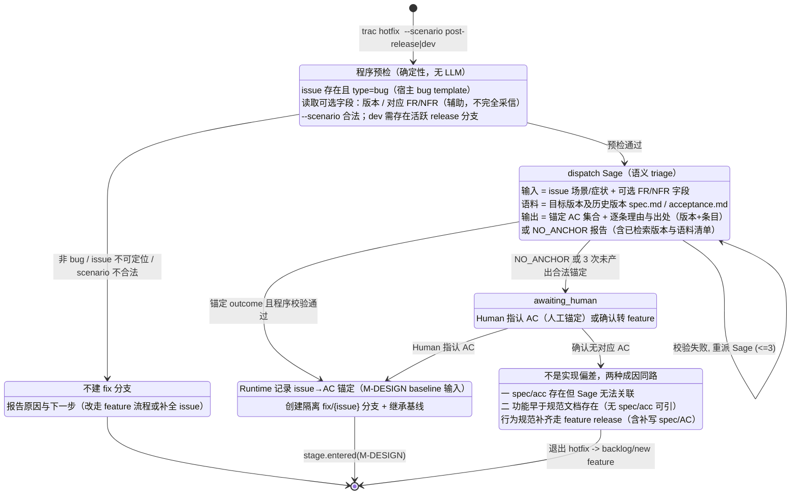
```mermaid
stateDiagram-v2
    direction TB

    [*] --> PRECHECK : trac hotfix <issue> --scenario post-release|dev

    PRECHECK : 程序预检（确定性，无 LLM）
    PRECHECK : issue 存在且 type=bug（宿主 bug template）
    PRECHECK : 读取可选字段：版本 / 对应 FR/NFR（辅助，不完全采信）
    PRECHECK : --scenario 合法；dev 需存在活跃 release 分支
    PRECHECK --> SAGE_TRIAGE : 预检通过
    PRECHECK --> REJECTED : 非 bug / issue 不可定位 / scenario 不合法

    REJECTED : 不建 fix 分支
    REJECTED : 报告原因与下一步（改走 feature 流程或补全 issue）
    REJECTED --> [*]

    SAGE_TRIAGE : dispatch Sage（语义 triage）
    SAGE_TRIAGE : 输入 = issue 场景/症状 + 可选 FR/NFR 字段
    SAGE_TRIAGE : 语料 = 目标版本及历史版本 spec.md / acceptance.md
    SAGE_TRIAGE : 输出 = 锚定 AC 集合 + 逐条理由与出处（版本+条目）
    SAGE_TRIAGE : 或 NO_ANCHOR 报告（含已检索版本与语料清单）

    SAGE_TRIAGE --> ANCHORED : 锚定 outcome 且程序校验通过
    SAGE_TRIAGE --> SAGE_TRIAGE : 校验失败, 重派 Sage (<=3)
    SAGE_TRIAGE --> AWAIT_HUMAN : NO_ANCHOR 或 3 次未产出合法锚定

    AWAIT_HUMAN : awaiting_human
    AWAIT_HUMAN : Human 指认 AC（人工锚定）或确认转 feature
    AWAIT_HUMAN --> ANCHORED : Human 指认 AC
    AWAIT_HUMAN --> FEATURE_ROUTE : 确认无对应 AC

    ANCHORED : Runtime 记录 issue→AC 锚定（M-DESIGN baseline 输入）
    ANCHORED : 创建隔离 fix/{issue} 分支 + 继承基线
    ANCHORED --> [*] : stage.entered(M-DESIGN)

    FEATURE_ROUTE : 不是实现偏差，两种成因同路
    FEATURE_ROUTE : 一 spec/acc 存在但 Sage 无法关联
    FEATURE_ROUTE : 二 功能早于规范文档存在（无 spec/acc 可引）
    FEATURE_ROUTE --> [*] : 退出 hotfix -> backlog/new feature
    FEATURE_ROUTE : 行为规范补齐走 feature release（含补写 spec/AC）
```

**规则**：

1. **锚定是 M-DESIGN 的输入，不是终点**：Archer 的 delta 设计必须承接锚定 AC 集合（逐条引用），Prism 在 M-DESIGN 评审时复核锚定；Prism 推翻锚定 → 回 SAGE_TRIAGE 重新锚定（上游产物缺陷，不消费 M-DESIGN 重派预算）。
2. **两种 NO_ANCHOR 成因同路转 feature**（用户裁定）：spec/acc 存在但 Sage 无法关联；或功能存在于历史版本、当时尚无规范 spec/acc 文档——都按 feature 处理，以便经 feature release 补齐程序行为规范；转出是产品决定，需 Human 确认（AWAIT_HUMAN），不自动转。
3. **预算**：SAGE_TRIAGE 校验失败重派 ≤3；第 3 次仍未产出合法锚定 → AWAIT_HUMAN（Human 可人工锚定或确认转 feature），不自动转 feature。
4. **无分支副作用**：REJECTED 与 FEATURE_ROUTE 不创建 `fix/{issue}` 分支；分支只在 ANCHORED 创建（Runtime 是唯一 branch authority）。
5. **事件**：`hotfix.requested` / `triage.prechecked` / `command.issued` / `outcome.received` / `anchor.validated` / `human.anchor(manual|feature_route)` / `stage.entered(M-DESIGN)` / `backlog.recorded`。

## 17. 通用返回、修改与恢复规则

### 17.1. Return Upstream

- Agent 只能返回有证据和锚点的 gap advisory；Runtime 根据 workflow 定义校验合法目标并移动流程。路由决定的机器可读形式是 FailureDecision（classification、target stage/owner、artifact disposition、new attempt kind、human_required），与 transition 一起 append-only 写入事件日志。
- 回 M-DESIGN：task graph/架构/接口/Test Plan/技术合同需要改变 → Archer+Prism 裁定，不需 Human。
- 回 M-SPEC/M-ACC：用户结果、权限、范围、数据后果、不可逆语义需要改变 → Runtime 先展示影响，Human 批准；修订后重新完成 review 与 M-REQ-APPROVAL。
- 返回后 Runtime 保留历史，但将目标之后的 task graph、baselines、lineage、commits/reviews、candidate、CI/artifact/security/release approval 标记 stale/superseded；不得继续复用旧绿色证据。

### 17.2. Human 或外部工具直接修改

- Runtime 在每个写 lease 和 program gate 前比较 workspace 与 baseline，识别 Human/外部直接修改的 diff，不静默覆盖。
- 符合 baseline 且过当前 review/gates → 可纳入受控 commit；有问题 → 相应 Agent 通过 discussion 提出，不把“Human 写的”当自动批准；改变 baseline 或来源不明 → 停止当前 task，要求合法 return-upstream 或 reconcile。

### 17.3. Retry、Waiver 与取消

- retry 只重试幂等/reconcile-safe 的 operation；每次 attempt 独立 identity，旧 attempt 不改写。
- waiver 只适用于 policy 明确列出的非关键检查，绑定 actor/理由/范围/candidate/到期条件。**不可 waiver**：M-REQ-APPROVAL、release approval、trace/freshness、required CI、artifact version、critical security、发布身份。
- Human 可取消未发布的 run：Runtime 停止新分派、处理当前 lease、保留审计、清理资源；已产生外部发布事实后只能进发布恢复/关闭，不得用取消抹除历史。
- 生产 Runtime Agent 派发不设 elapsed-time 超时：工作中的 Agent 不会仅因 N 秒过去而被杀死；活动性由 Runtime/operator 观测，显式 Human Ctrl-C 取消并清理进程组（D-11 取消协议）。测试 harness/网络/CI 总看门狗属独立测试/IO 关注点，可保留有界超时。
- 模型选择归 opencode agent/project 配置；tracks 不得在应用代码中把 IQ 档位映射到 provider/model。显式 `TRAC_AGENT_MODEL` 仅作 operator override。
- 升级可观测：<=3 次失败后，`trac run` 与 `trac status` 必须暴露 attempt 计数 + 失败类 + 原因。Human 可运行 `trac retry`--追加 `human.retry` 事件、清除升级 gate、重置一份新的 <=3 attempt 预算、保留失败证据，且不自动重新派发；后续由显式 `trac run` 恢复。
- `trac run` 必须为长时间 Agent 派发发出简洁、已 flush 的控制台活动：开始输出时间戳/Agent/stage(substate)/task(attempt)，完成输出状态/失败与耗时；不得流式输出海量 Agent stdout。
