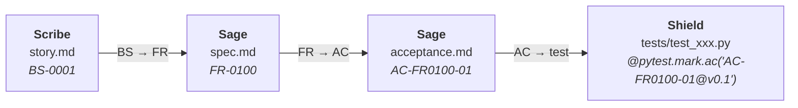

# 规格只是入口，证据才是出口

规格驱动开发（spec-driven development）的赛道，从来没有像今天这样拥挤过。

GitHub 官方的 spec-kit 星标已过十万；AWS 推出 Kiro，把"先写需求、再让 AI 实现"做进了企业级 IDE；Tessl 自称 spec-first coding；连 OpenSpec 这样的轻量规格管理工具也上了 ThoughtWorks 技术雷达。

这是好事。它说明"先把需求写清楚，再让 Agent 动手"正在从小众实践变成行业共识。

Agent OnTracks 的不同之处，**不在方法论**。规格先行、测试先行、红-绿-重构——这些概念全都诞生了几十年，大家说的都是同一套。

关键在**落实**。

规格写下来之后，谁来验证它被遵守了？Agent 说"做完了"之后，谁来确认？市面上几乎所有人的答案是：相信 Agent 的自述。勾选框由 Agent 自己打，然后相信它打了。

Agent OnTracks 的答案不一样：**规格只是入口，证据才是出口。**所有验证都由 Runtime 从现实世界重读完成——Agent 的自述，从头到尾不算证据。

## 竞品方案

在 Agent OnTracks 之前，如果要为 AI 开发选一套流程，大致是四类选择。

**第一类：规格驱动工具**（spec-kit、Kiro、Tessl、OpenSpec）。

它们解决的是"输入从哪来"：让 Agent 看着规格干活，而不是凭一句话发散。这一类里 spec-kit 声量最大，Kiro 最深（需求、设计、任务三文档联动）。但验证环节仍然靠会话内的 Agent 自觉：宪法条款写在模板里，由 Agent 自己勾选确认。生产者同时是验收者 —— 自己能不能监督自己，这是一个问题。

**第二类：多智能体编排框架**（MetaGPT、CrewAI、LangGraph）。

它们解决的是"多个 Agent 怎么分工"：产品经理、架构师、工程师、QA，各就各位。MetaGPT 在精神上离Tracks 最近——它用 SOP 模拟一家软件公司。但公司里坐着的还是同一个大脑：写代码的和做 QA 的是同一类模型，共享同一份上下文。角色分工不等于证据独立——角色扮演产生不了信任边界。

**第三类：harness 厂商捆绑的流程功能**（Claude Code 的 hooks/skills、Codex、Devin）。

轻量、开箱即用，跟着成熟的运行时一起到手 —— 对很多场景这就够了。但注意一个事实：这些流程全部绑定在单一运行时里。Claude Code 的流程只属于 Claude Code；换一个运行时，一切归零。流程是 Harness 的功能，不是项目的资产。同样，需求有没有做完，仍然是 Agent 自说自话，没有经过滴水不漏的审计。

**第四类：碎片化的验证工具链**（各类 eval 框架、CI 门禁）。

散落着，各自解决验证问题的一个碎片，但至今没有人把"证据"整合成一条完整的流程叙事。

一句话总结这个格局：**所有人都在回答"怎么让 Agent 做"，没有人认真回答"怎么证明它做成了"。**

| 维度         | 规格驱动工具      | 编排框架 | harness 捆绑流程      | Agent OnTracks                 |
| ------------ | ----------------- | -------- | --------------------- | ------------------------------ |
| 流程由谁驱动 | Agent 会话 / 模板 | 框架编排 | 厂商内置功能          | Tracks Runtime                 |
| 完成由谁认定 | Agent 自查勾选    | 角色自报 | Agent 自报 + 轻量检查 | 程序证据: 需求追踪链、RGR循环  |
| 测试何时写   | 实现之后          | 实现之后 | 实现之后（不强制）    | 实现之前                       |
| 流程状态在哪 | 会话上下文        | 框架内存 | 会话 / 厂商云端       | 事件流，可回放，可审计，可改进 |
| harness 绑定 | 锁厂商            | 锁框架   | 锁单一运行时          | 无关，可整体迁移               |

## Tracks 的答案

落实分两步。第一步回答"怎么知道每条需求都被实现了"；第二步更根本——它回答"凭什么相信这些证据"。

### 一、需求追踪链：每条需求都有测试代码

在Tracks 开发的项目中，所有的测试代码都会带有需求验收 ID 标记，比如：

```md
# AC-FR0010-04 full journey to boundary
def test_full_journey_to_boundary(host_repo, trac, event_log):
    """integration does not change transitions, events, or boundary terminal."""
    run_id = walk_to_await_human(trac)
    evs = event_log(run_id)
    ...
```

第一行注释把测试与spec/acceptance 文档关联了起来。现在，你的需求有没有真正被实现，就不再是一句空话，而是变成了一个低成本（由Tracks 保证）、高可靠的程序判定。

哪怕只有一个 acceptance 项没有被测试所覆盖，Tracks 都会把任务发回给 Shield，让它重新补测试用例。

tracks 给每个需求项、每条验收标准、每条测试编号，连成一条可被机器清点的链。从上游的行为种子开始，到分阶段展开的需求、验收标准和测试代码，阶段的关注点在变，但对软件行为、需求的跟踪永远保持不丢失：



**Trace 闭合**，就是机器对这条链做双向清点：

- 有需求，却没有任何测试验证它——**硬错误**。这意味着需求写在纸上，但没有任何东西能证明它被实现了。
- 有测试，却不指向任何需求——**硬错误**。这意味着一堆测试和垃圾代码在跑，却没人说得清它们在做什么。

Trace 闭合只能证明"每条 AC 都有一条 test 在盯着它"。但盯着不等于实现 —— test 自己可以是错的，test 可以测错东西。怎么证明 production code 真的满足了 test？

靠外层 RGR 循环的结构隔离。Shield 在任 production code 存在之前写 test，它面对的只有接口桩与 AC，没有 SUT 可迎合；Devon写 production code 时看不到 tests/integration/ 与 tests/e2e/ 目录，于是它让 test 由红变绿的路只有一条：真的把接口接上。

test 测的是 AC，production code 在不见 test 原文的前提下让test 由红变绿 —— 所以 production code 必然实现了 AC。

<!--
实现这一头还要再进一步：模块存在，不等于可用。在 louke（tracks 的前身项目）的一次尸检中，我们发现了一个触目惊心的事实：117 个生产模块里，**79 个是幽灵**——存在于代码库里，却从程序的任何一个真实入口（命令行、API、界面）都走不到。没有人调用它们，它们只是躺在那里消耗扫描的 token、诱发 AI 的幻觉，并在每一次重构里被当作"有效代码"小心维护。reach 闭合（`trac check reach`）就是从程序声明的全部入口出发做可达性分析：**每个生产模块必须被走到**。走不到的模块就是孤岛——要么接线让它活过来，要么从设计里删掉。-->

> [!info] 需求可追溯性（Requirements Traceability）
>
> 需求追溯的学术源头通常追溯到 Gotel 与 Finkelstein 1994 年的 ["An Analysis of the Requirements Traceability Problem"](https://www.doc.ic.ac.uk/~gkf/papers/traceability.pdf)；EARS 需求语法（Rolls-Royce，2009）则给了需求项标准化的写法。行业实践里，追溯长期以"追溯矩阵"的形式存在——一份人工填写、人工评审的文档。tracks 的做法不同：追溯不是文档，是**机器门禁**。矩阵会漂移，门禁不会。

> [!info] 孤岛与可达性
>
> 静态可达性分析是编译器与程序分析领域的成熟技术（调用图构造可回溯到 1970 年代的 interprocedural analysis 文献），死代码消除（dead code elimination）是它的经典应用。tracks 的独特点在于把它用作**需求侧的证据**：一个从任何交付面都不可达的模块，等于一条被实现却无人能用的需求——它不是代码质量问题，是需求缺口。

### 二、让测试为真：从源头杜绝造假

但上面这条链有一个比它本身更根本的前提：**测试必须是真实、可靠的**。测试若是假的，追踪链闭合得再完美，也只证明需求被"纸面实现"了——产品的功能照样没有实现。

而测试造假，恰恰是 TDD 落到 AI Agent 身上时最大的风险：同一个 Agent 可以先编造一个失败的测试，再在写实现的过程中连同测试一起改掉，最后全绿。代码错了，测试也跟着错，两个错误互相印证，跑出一片祥和的绿。

药方并不新：测试先行，红-绿-重构（RGR，Kent Beck《Test-Driven Development: By Example》）。tracks 做的事情，是把它们真正落实。

**测试先于实现。** 集成测试与端到端测试由测试工程师 Shield 在**任何实现代码存在之前**编写——它面对的只有接口桩（只有函数签名、没有真实行为的占位代码）和验收标准（ACC）。实现还没出生，测试写下的期望结果就只有一个来源：需求。它没有第二个来源可以迎合。

**红必须失败得正确。** 这批测试写出来时实现尚不存在，所以必然全红——红是正常的。但 M-TEST 的出口门禁不只看红，它区分两种红：

- **合法的红**：断言失败——"我期望返回 3，实际抛出'未实现'"。这证明测试真的有能力区分"正确实现"与"尚未实现"。
- **非法的红**：语法错误、import 找不到、测试自己写崩了。这只证明测试是坏的，什么都没验证。

出口条件是：**所有测试可运行，且每一个失败都失败在正确的地方**。这就是**合法 Red**——失败也要失败得正确。为什么要多此一举？因为红这一步是唯一能证明"测试本身有效"的机会。如果这里的红是非法的，后面所有的绿都建立在沙子上。这个检查同样由 Runtime 执行——测试自己坏了却汇报说"红了"，在Tracks 里走不出这一步。

> [!info] 合法 Red 与变异测试（Mutation Testing）
>
> "测试必须有能力区分正确实现与错误实现"这个思想，在学术界有经典源头：DeMillo、Lipton 与 Sayward 1978 年的 ["Hints on Test Data Selection Criteria"](https://scholar.google.com/scholar?q=Hints+on+Test+Data+Selection+Criteria)被视为变异测试的起点——故意往程序里注入小错误，检验测试能否将其捕获。tracks 把它前置成了合同纪律：关键测试要配一个"故意写错的最小补丁"（counterexample），测试必须能杀死它。测试有没有牙齿，不靠声称，靠实验。

**大小两个测试循环。** 测试的效力不靠一次冲刺，靠两圈咬合：

- **外圈是合同循环**：Shield 写下的集成/端到端测试，先行变红，冻结为基线，然后整个实现阶段（M-IMPL）的目标就是把它们全部变绿。最终验收时变绿的，不是"某个测试"，而是**实现存在之前就已写好的合同**。
- **内圈是 RGR 循环**：实现被拆成一个个任务，每个任务内部走一遍完整的红-绿-重构：🔴 先写失败的单元测试，🟢 用最少代码变绿，🔵 在全绿保护下重构。每一次红，Runtime 都校验它是否合法——行为断言的失败才算数，测试写崩了自己不算；每一个红 checkpoint，都有独立的评审者 Prism 检查它是否真的在测该测的东西，然后才允许进入绿。

**结构隔离：想作弊也做不到。** 写实现的 Devon 看不到集成与端到端测试的目录——它让合同测试变绿的路只有一条：正确实现合同。测试与实现各执一词时，由没写过这两者的第三方 Prism 裁决。生产者、验证者、裁决者，三个互不知晓对方上下文的独立智能。**"自证"在这个结构里没有容身之处**——这不是要求 Agent 诚实，而是让它即使想作弊也做不到。

于是闭环成立：测试基于接口桩与验收标准写就，期望只能来源于需求；实现完成后，两边对上了——而写实现的一方从始至终没见过合同测试的原文——那么绿就不是自述，是事实：**这条需求必然被实现了**。

### 三、验证这件事，由 Runtime 完成

回头看上面每一道门禁：清点追踪链的是程序，判定红是否合法的是程序，重读测试退出码确认变绿的也是程序。没有一道门是 Agent 汇报的。tracks 的第十一条不变量写着：**Agent 自报不是证据**（完整论证见[Runtime 是唯一的 authority](why-runtime-is-authority.md)）。

而整个流程的状态，是一条只追加的事件流：**可回放**——同一份事件日志重放，得到完全相同的终态；**可恢复**——进程被 `kill -9` 杀死，重启后精确回到断点；**可审计**——每一步都有据可查：谁做的、什么时候、依据什么证据。当"开发流程"本身变成可验证的物理事实，你才第一次有资格回答"这个软件是怎么被造出来的"——对任何需要审计的场景（合规、外包验收、事故复盘），这个问题值很多钱。

### 四、harness 无关：流程属于项目，不属于厂商

tracks 不是又一个 harness——它骑在任何 Agent 运行时之上。今天是 opencode，明天可以换。harness 厂商的流程功能绑定在单一运行时里；tracks 的流程资产（事件流、需求链、测试合同、全部文档）长在你的项目里。**换运行时，流程跟着你走。**

## 该怎么选

tracks 不适合所有场景。

如果你做的是一次性原型、周末脚本，harness 自带的轻量流程就够了——tracks 的完整证据链在这种场景里是负担。但如果这个软件要交付、要验收、要审计、要长期维护——你需要回答"它是谁做的、什么时候做的、凭什么证据说它做对了"——那就是Tracks 的位置。

也要诚实说明当下的成本：当前版本的学习曲线不为零。十三个阶段、全套文档体系、一组专职 Agent——spec-kit 五分钟就能 init，tracks 需要理解。这已经在路线图上：后续版本将推出**类似 louke 的 web 界面**，并配一名常驻的 **guide agent**——你不需要背下流程，guide 会一步步告诉你现在该做什么、对谁说什么、结果去哪里看。流程保持严谨，进入流程变得容易。

## 结语

巨头们用六位数的星标证明了"规格驱动"是真需求。但方法论从来不是分水岭——所有人都会说规格先行、测试先行。分水岭是：当 Agent 说"做完了"，你信什么。

写规格，谁都能学会；把"做成了"变成可以重放的物理事实，需要一个不信任何人的运行时。

这个运行时，就是 tracks。
